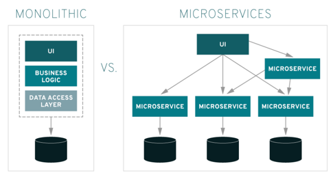

## MicroService란?

마이크로 서비스란 소프트웨어를 구축하기 위한 아키텍처이자 하나의 접근방식으로, 애플리케이션을 상호 독립적인 최소 구성요소로 분할한다. 모든 요소를 하나의 애플리케이션에 구축하는 전통적인 모놀리식 접근 방식 대신 마이크로 서비스에서는 모든 요소가 독립적이며 연동되어 동일한 태스크를 완수한다.

마이크로서비스를 전통적인 모놀리식 접근 방식과 구별 짓는 기준은 애플리케이션을 핵심 기능으로 세분화하는 방식이다. 각 기능을 서비스라고 부르며, 독립적으로 구축하고 배포할 수 있다. 이는 개별 서비스가 다른 서비스에 부정적 영향을 주지 않으면서 작동할 수 있음을 의미한다.

마이크로서비스 아키텍처는 애플리케이션의 핵심 기능을 유연하게 결합할 뿐만 아니라, 불가피한 장애, 향후 확장 여부 및 새로운 기능 통합에 대비할 수 있도록 서비스 간 커뮤니케이션 및 개발팀의 구조를 조정하는 것이다.
이를 실현하는 방법이 서비스 지향 아키택처(SOA)의 기본 사항을 채택해 마이크로서비스를 배포하는 것이다.

### 모놀리식 접근 방식

전통적인 모놀리식 방식은 전체 애플리케이션의 소스 코드에 하나의 배포 유닛(`.war`)으로 내장되기 때문에 일부 애플리케이션의 업데이트로 인해 오류가 발생할 경우, 전체를 오프라인으로 전환하고 운영 규모를 축소시킨 다음에 문제를 해결해야했다. 이러한 방식은 소규모 애플리케이션에 적합합니다.

### 서비스 지향 아키텍처(SOA)

서비스 지향 아키텍처는 애플리케이션을 별개의 재사용 가능한 서비스 단위로 분할하며 이 서비스들은 엔터프라이즈 서비스 버스(`ESB`) 를 통해 통신합니다.

이러한 방식에서 서비스의 구축, 테스트, 수정을 동시에 수행할 수 있기 때문에 더 이상의 모놀리식 개발 주기는 필요없어집니다.

### SOA에서 마이크로서비스로

SOA와 MSA의 차이점은 마이크로서비스는 stateless 방식으로 서로 통신을 할 수 있으며 이러한 방식으로 구축된 애플리케이션은 내결함성이 더 높고 단일 ESB에 대한 의존성이 더 낮습니다.
그리고 마이크로서비스는 프로그래밍 언어에 구속 받지 않는 API이므로 개발팀이 자체 툴을 선택할 수 있습니다.

### 마이크로서비스 아키텍처의 장점
- 높은 확장성
  - 특정 서비스에 대한 수요가 증가함에 따라 여러 서버 및 인프라에 배포 가능
- 뛰어난 복구 능력
  - 모놀리식 애플리케이션 모델과는 달리 한 부분에 장애가 발생하더라도 전체 애플리케이션이 다운되지 않음
- 손쉬운 배포
  - 모놀리식 애플리케이션에 비해 더욱 모듈화되고 규모가 작아졌기 때문에 배포에 따르는 우려사항이 사라짐.
- 향상된 개발성
  - 다중 언어 지원 API를 사용하기 때문에 개발자들이 언어와 기술 선택 가능

## 참고
- https://www.redhat.com/ko/topics/microservices/what-are-microservices
