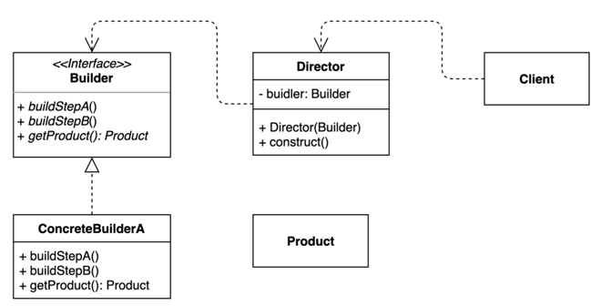

# 빌더(Builder) 패턴
> 동일한 프로세스를 거쳐 다양한 구성의 인스턴스를 만드는 방법

- (복잡한) 객체를 만든느 프로세스를 독립적으로 분리할 수 있다.


```java
// interface
public interface TourPlanBuilder {

    TourPlanBuilder nightsAndDays(int nights, int days);

    TourPlanBuilder title(String title);

    TourPlanBuilder startDate(LocalDate localDate);

    TourPlanBuilder whereToStay(String whereToStay);

    TourPlanBuilder addPlan(int day, String plan);

    TourPlan getPlan();

}

// class
public class DefaultTourBuilder implements TourPlanBuilder {

    private String title;

    private int nights;

    private int days;

    private LocalDate startDate;

    private String whereToStay;

    private List<DetailPlan> plans;

    @Override
    public TourPlanBuilder nightsAndDays(int nights, int days) {
        this.nights = nights;
        this.days = days;
        return this;
    }

    @Override
    public TourPlanBuilder title(String title) {
        this.title = title;
        return this;
    }

    @Override
    public TourPlanBuilder startDate(LocalDate startDate) {
        this.startDate = startDate;
        return this;
    }

    @Override
    public TourPlanBuilder whereToStay(String whereToStay) {
        this.whereToStay = whereToStay;
        return this;
    }

    @Override
    public TourPlanBuilder addPlan(int day, String plan) {
        if (this.plans == null) {
            this.plans = new ArrayList<>();
        }

        this.plans.add(new DetailPlan(day, plan));
        return this;
    }

    @Override
    public TourPlan getPlan() {
        return new TourPlan(title, nights, days, startDate, whereToStay, plans);
    }
}
```

### 장점 및 단점
- 장점
  - 만들기 복잡한 객체를 순차적으로 만들 수 있다.
  - 복잡한 객체를 만드는 구체적인 과정을 숨길 수 있다.
  - 동일한 프로세스를 통해 각기 다르게 구성된 객체를 만들 수도 있다.
  - 불완전한 객체를 사용하지 못하도록 방지할 수 있다.
- 단점
  - 원하는 객체를 만들려면 빌더부터 만들어야 한다.
  - 구조가 복잡해진다.(trade off)
