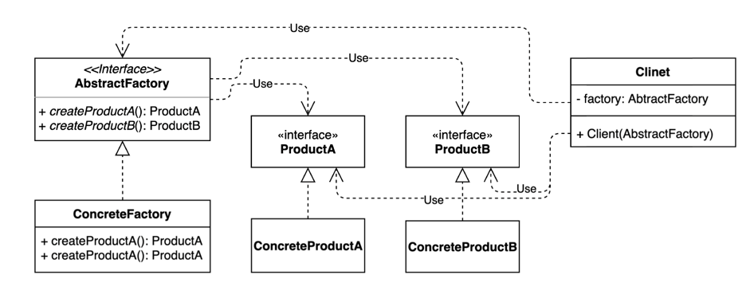

# 추상 팩토리 패턴(Abstract Factory)
> 서로 관련있는 여러 객체를 만들어주는 인터페이스

- 구체적으로 어떤 클래스의 인스턴스를 사용하는지 감출 수 있다.

  
- 클라이언트 코드에서 구체적인 클래스의 의존성을 제거한다.

### 추상 팩토리 패턴 vs 팩토리 메소드 패턴
- 공통점 : 둘 다 구체적인 객체 생성 과정을 추상화한 인터페이스를 제공한다.
- 차이점 :
  - 관점이 다르다.
    - 팩토리 메소드 패턴은 '팩토리를 구현하는 방법(inheritance)'에 초점을 둔다.
    - 추상 팩토리 패턴은 '팩토리를 사용하는 방법(composition)'에 초점을 둔다.
  - 목적이 다르다.
    - 팩토리 메소드 패턴은 구체적인 객체 생성 과정을 하위 또는 구체적인 클래스로 옮기는 것이 목적
    - 추상 팩토리 패턴은 관련있는 여러 객체를 구체적인 클래스에 의존하지 않고 만들 수 있게 해주는 것이 목적

## 출처
- [인프런 - 코딩으로 학습하는 GoF의 디자인 패턴(백기선)](https://www.inflearn.com/course/%EB%94%94%EC%9E%90%EC%9D%B8-%ED%8C%A8%ED%84%B4/)
