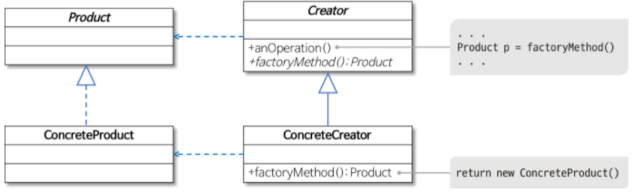

# 팩토리 메소드 패턴
> 객체를 만들어내는 부분을 서브 클래스에 위임하는 패턴 (객체를 만들어내는 공장(Factory 객체)을 만드는 패턴)

- 역할이 수행하는 작업
  - Product
    - 팩토리 메서드로 생성될 객체의 공통 인터페이스
  - ConcreteProduct
    - 구체적으로 객체가 생성되는 클래스
  - Creator
    - 팩토리 메서드를 갖는 클래스
  - ConcreteCreator
    - 팩토리 메서드를 구현하는 클래스로 ConcreteProduct 객체를 생성

### 장점
- 객체의 생성 코드를 별도의 클래스/메소드로 분리함으로써 객체 생성의 변화에 대비하는데 용이

###  팩토리 패턴 사용 이유
- 팩토리 메소드 패턴을 사용하는 이유는 클래스의 생성과 사용의 처리로직을 분리하여 결합도를 낮추기 위한 것임.
  결합도는 간단히 말해서 클래스의 처리 로직에 대한 변경점이 생겼을 때 얼마나 사이드 이펙트를 주는가 인데, 팩토리 메소드 패턴을 사용할 경우 직접 객체를 생성해 사용하는 것을 방지하고 서브 클래스에 생성 로직을 위임함으로써 보다 효율적인 코드 제어를 할 수 있고 의존성을 제거한다.

### 참고
- https://gmlwjd9405.github.io/2018/08/07/factory-method-pattern.html
- https://bamdule.tistory.com/157
