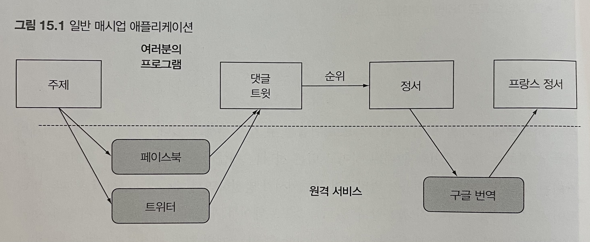

# 모던 자바 인 액션 15장

# CompletableFuture와 리액티브 프로그래밍 컨셉의 기초

### 15장에서는...



[그림 15.1] 특정 주제의 댓글 추세를 페이스북이나 트위터 API로 찾은 다음 내부 알고리즘과 가장 일치하는 주제로 등급을 매겨서 주어진 프랑스 사용자들에게 제공할 소셜 미디어 정서를 수집하고 요약하는 웹 사이트

애플리케이션의 생산성을 확대시키려면 API나 데이터베이스의 결과를 기다리는 스레드를 블록함으로서 연산 자원을 낭비하는 일은 피해야 합니다. 위 구조에서는 페이스북 데이터를 기다리는 동안 트위터 데이터를 처리할 수 있을 것입니다.

이러한 개념을 16장 CompletableFutre, 17장 리액티브 프로그래밍에서 자세히 설명하며 15장에서는 바탕이 되는 기본 개념을 설명합니다.

## 동시성 vs 병렬성

- 동시성


- 병렬성


(그림 출처: [https://www.charlezz.com/?p=44646](https://www.charlezz.com/?p=44646))

## 동시성을 구현하는 자바 지원의 진화

### Thread / Runnable

자바에서 멀티쓰레드 프로그래밍을 하기 위해서는 Thread/Runnable을 이용하는 방법이 있습니다.

```java
// Thread 상속
public static void main(String[] args) {
    HelloThread helloThread = new HelloThread();
    helloThread.start();
    System.out.println("hello : " + Thread.currentThread().getName());
}
static class HelloThread extends Thread {
    @Override
    public void run() {
        System.out.println("world : " + Thread.currentThread().getName());
} }

// Runnable 구현 또는 람다 이용
Thread thread = new Thread(() -> System.out.println("world : " + Thread.currentThread().getName()));
thread.start();
System.out.println("hello : " + Thread.currentThread().getName());
```

### Executors

- Thread를 만들고 관리하는 작업을 애플리케이션에서 분리하며 이를 Executors에게 위임
- Executors가 하는일
    - Thread 만들기: 애플리케이션이 사용할 Thread pool을 만들어 관리
    - Thread 관리: Thread 생명 주기를 관리
    - 작업 처리 및 실행: Thread로 실행할 작업을 제공할 수 있는 API를 제공
- 주요 인터페이스
    - Executor: execute

  

    - ExecutorService
        - Executor 상속 받은 인터페이스로, Callable도 실행할 수 있으며, Executor를 종료시키거나, 여러 Callble을 동시에 실행하는 등의 기능을 제공

  

    - ScheduleExecutorService: ExecutorService를 상속받은 인터페이스로 특정 시간 이후에 주기적으로 작업을 실행할 수 있다.

  


```java
ExecutorService executorService = Executors.newSingleThreadExecutor();
executorService.submit(() -> {
    System.out.println("Hello :" + Thread.currentThread().getName());
});

executorService.shutdown();
```

### Callable / Future

**Callable**

- Runnable과 유사하나 작업의 결과를 받을 수 있다.


**Future**

- 비동기적인 작업의 현재 상태를 조회하거나 결과를 가져올 수 있다.

```java
ExecutorService executorService = Executors.newSingleThreadExecutor();
Future<String> helloFuture = executorService.submit(() -> {
    Thread.sleep(2000L);
    return "Callable";
});
System.out.println("Hello");
String result = helloFuture.get(); // blocking
System.out.println(result);
executorService.shutdown();

// Console
Hello
Callable //2초 후에 나타남
```

### Executor와 Thread Pool

### Thread의 문제

운영체제 스레드를 만들고 종료하려면 비싼 비용을 치러야 하며 운영체제 Thread의 숫자는 제한되어있다. 따라서 운영체제가 지원하는 Thread 수를 초과해 사용하면 자바 애플리테이션이 crush될 수 있으므로 기존 Thread가 실행되는 상태에서 계속 새로운 Thread를 만드는 상황이 일어나지 않도록 주의해야한다,

ex) 웹 애플리케이션 등에서 모든 요청마다 `ExecutorService`를 생성하지 말라. 요청이 폭주할 때 요청보다 더 많은 쓰레드가 생성된다. 미리 생성해둔  `ExecutorService`를 재사용해야한다.

**Thread Pool이 더 좋은 이유**

`ExecutorService`는 task를 제출하고 나중에 결과를 수집할 수 있는 인터페이스를 제공한다. 프로그램은 `newFixedThreadPool`을 이용해 Thread Pool을 만들어 사용할 수 있다.


프로그래머가 task(Runnable이나 Callable)을 제공하면 Thread가 이를 실행하는 방식으로 Thread pool에서 사용하지 않은 Thread로 제출된 task를 먼저 온 순서대로 실행하고, 이들 task가 종료되면 사용한 Thread를 pool로 반환한다. 이 방식의 장점은 하드웨어에 맞는 수의 task를 유지함과 동시에 수 천개의 task를 Thread pool에 아무 오버헤드 없이 제출할 수 있다는 점이다.

**Thread Pool이 나쁜 이유**

Thread를 직접 사용하는 것보단 Thread Pool을 이용하는 방법이 바람직하지만 두 가지 주의사항이 있다.

- n개의 Thread를 가진 Thread Pool은 오직 n만큼의 Thread를 동시에 실행할 수 있다.
    - 핵심은 block할 수 있는 task는 Thread Pool에 제출하지 말아야한다는 점이다.

  

  

- 프로그램을 종료하기 전에 모든 스레드 풀을 종료해야 한다.
    - 실행 명령한 Task가 모두 수행되어도 ExecutorService는 자동으로 종료되지 않는다. 앞으로 들어올 Task를 처리하기 위해 Thread는 wait 상태로 대기한다. 그러므로 종료를 위해서는 제공되는 shutdown() 이나 shutdownNow() API를 사용해야 한다.

## 동기 API와 비동기 API

다음과 같은 시그니처를 갖는 f, g 두 메서드의 호출을 합하는 예제

```java
int f(int x);
int g(int x);
```

**동기 API**

```java
int y = f(x);
int z = g(x);

System.out.printlin(y + z);
```

**비동기 API**

- 별도의 Thread로 구현하는 방법 (Runnable 사용)

```java
class ThreadExample {
	public static void main(String[] args) throws InterruptedException {
		int x = 1337;
		Result result = new Result();
		
		Thread t1 = new Thread(() -> { result.left = f(x); };
		Thread t2 = new Thread(() -> { result.right = g(x); };

		t1.start();
		t2.start();
		
		t1.join();
		t2.join();

		System.out.println(result.left + result.right);
  }

	private static class Result {
		private int left;
		private int right;	
	}
}
```

- Future API 인터페이스 사용

```java
public class ExecutorServiceExample {
	public static void main(String[] args) 
															throws ExecutionException, InterruptedException {
	  int x = 1337;

		ExecutorService executorService = Executors.newFixedThreadPool(2);
		Future<Integer> y = executorService.submit(() -> f(x));
		Future<Integer> z = executorService.submit(() -> g(x));

		System.out.println(y.get() + z.get());

		executorService.shutdown();
}
```

→ 이 코드에서도 명시적인 `submit` 메서드 호출 같은 불필요한 코드가 존재한다.

문제의 해결은 비동기 API 기능을 이용해 해결할 수 있다.

- Future 형식 API

```java
// 시그니처
Future<Integer> f(int x);
Future<Integer> g(int x);

// 호출
Future<Integer> y = f(x);
Future<Integer> z = g(x);
System.out.println(y.get() + z.get());
```

- 리액티브 형식 API

  f, g의 시그니처를 바꿔서 콜백 형식의 프로그래밍을 이용


```java
// 시그니처
void f(int x, IntConsumer dealWithResult);
```

```java
public class CallbackStyleExample {
	public static void main(String[] args) {
		int x = 1337;
		Result result = new Result();

		f(x, (int y) -> {
				result.left = y;
				System.out.println(result.left + result.right);
		});

		g(x, (int z) -> {
				result.right = z;
				System.out.println(result.left + result.right);
		});
	}
}
```

이 방법은 f와 g의 호출 합계를 정확하게 출력하지 않고 상황에 따라 먼저 계산된 결과를 출력한다. lock을 사용하지 않으므로 값을 두 번 출력할 수 있을 뿐더러 때로는 `+`에 제공된 두 피연산자가 println이 호출되기 전에 업데이트 될 수도 있다. 다음처럼 두 가지 방법으로 이 문제를 보완할 수 있다.

- `if-then-else` 를 이용해 적적한 lock을 이용해 두 콜백이 모두 호출되었는지 확인한 다음 println을 호출해 원하는 기능을 수행할 수 있다.
- 리액티브 형식의 API는 보통 한 결과가 아니라 일련의 이벤트에 반응하도록 설계되었으므로 Future를 이용하는 것이 더 적절하다.

→ 리액티브 형식의 비동기 API는 자연스럽게 일련의 값(나중에 스트림으로 연결)을, Future API는 일회성의 값을 처리하는데 적합하다.

**잠자기(그리고 기타 blocking 동작)은 해로운 것으로 간주**

Thread Pool에서 잠을 자는 task는 다른 task를 시작하지 못하게 막으므로 자원을 소비하는 사실을 기억해야한다. (운영체제가 task를 관리하므로 일단 Thread로 할당된 task는 중지시키지 못한다.)

물론 Thread Pool에서 잠자는 스레드만 실행을 막는 것이 아니라 모든 blocking 동작도 주의해야한다.

- 대안
    - 태스크를 앞과 뒤 부분으로 나누고 블록되지 않을 때만 뒷부분을 자바가 스케줄링하도록 요청할 수 있다.

```java
// code A
work1();
Thread.sleep(10000); // 10초 동안 잠
work2();

// code B
public class ScheduledExecutorServiceExample {
	public static void main(String[] args) {
		ScheduledExecutorService scheduledExecutorService = Executors.newScheduledThreadPool(1);

		work1();
		// work1이 끝난 다음 10초 후 work2()를 개별 task로 스케줄함
		scheduledExecutorService.schedule(
			ScheduledExcutorServiceExample::work2, 10, TimeUnit.SECONDS);

		scheduledExecutorService.shutdown();
	}
	
	public static void work1() {
		System.out.println("Hello from work1");
	}

	public static void work2() {
		System.out.println("Hello from work2");
	}

}
```

- code B가 더 좋은 이유?
    - 코드 A나 B나 모두 같은 동작을 수행한다. 두 코드의 다른 점은 A가 자는 동안 귀중한 스레드 자원을 점유하는 반면 B는 다른 작업이 수행할 수 있도록 허용한다는 점이다.
- Task가 실행되면 귀중한 자원을 점유하므로 Task가 끝나서 자원을 해제하기 전까지는 Task를 계속 실행해야한다. Task를 block하는 것보다는 다음 작업을 Task로 제출하고 현재 Task는 종료하는 것이 바람직하다.

**현실성 확인**

모든 동작을 비동기 호출로 구현한다면 병렬 하드웨어를 최대한 활용할 수 있다. 하지만 현실적으로 '모든 것은 비동기'라는 설계 원칙을 어겨야한다. ('최상의 좋은 것은 적이다.')

모든 API를 비동기로 만드는 것을 따지지 말고 개선된 동시성 API를 사용해보길 권장한다.

**비동기 API에서의 예외처리**

- CompletableFuture에서는 get() 메서드에 예외에서 회복할 수 있도록 `exceptionally()`를 제공한다.
    - 자세한 내용은 16장에서 소개하므로 생략


## CompletableFuture와 콤비네이터를 이용한 동시성

자바 8에서는 `Future` 인터페이스의 구현인 `CompletableFuture`를 이용해 `Future`를 조합할 수 있는 기능을 추가했다.

`CompletableFuture`에서는 두 작업을 조합할 수 있는 함수를 제공한다.

- thenCompose(): 두 작업을 서로 이어서 실행하도록 조합
- thenCombine(): 두 작업을 독립적으로 실행하고 둘 다 종료했을 때 콜백 실행
- allOf(): 여러 작업을 모두 실행하고 모든 작업 결과에 콜백 실행
- anyOf(): 여러 작업 중에 가장 빨리 끝난 하나의 결과에 콜백 실행

```java
public class CFCombine {
	public static void main(String[] args) throws ExecutionException, InterruptedException {
		ExecutorService executorService = Executors.newFixedThreadPool(10);
		int x = 1337;

		CompletableFuture<Integer> a = new CompletableFuture<>();
		CompletableFuture<Integer> b = new CompletableFuture<>();
		CompletableFuture<Integer> c = a.thenCombine(b, (y, z) -> y + z);
		executorService.submit(() -> a.complete(f(x));
		executorService.submit(() -> b.complete(g(x));
		
		System.out.println(c.get());
		executorService.shutdown();
	}
}
```

Future `a`, Future `b`의 결과를 알지 못한 상태에서 `thenCombine`은 두 연산이 끝났을 때 스레드 풀에서 실행된 연산을 만든다. 결과를 추가하는 세 번째 연산 `c`는 다른 두 작업이 끝날때까지는 스레드에서 실행되지 않는다. 따라서 이 코드에서는 block이 되는 부분이 존재하지 않는다.

## 발행-구독 그리고 리액티브 프로그래밍

Future는 **한 번**만 실행해 결과를 제공한다.

반면 리액티브 프로그래밍은 시간이 흐르면서 여러 Future와 같은 객체를 통해 여러 결과를 제공한다.

- 예시 1) 온도계 객체는 매 초마다 온도 값을 반복적으로 제공한다.
- 예시 2) 웹 서버 컴포넌트 응답을 기다리는 리스너 객체

자바 9에 추가된 `Flow` 의 인터페이스에 발행-구독 모델을 적용해 리액티브 프로그래밍을 제공한다.

- **구독자**가 구독할 수 있는 **발행자**
- 이 연결을 **구독(subscription)**이라고 한다.
- 이 연결을 이용해 **메세지(이벤트)**를 전송한다.


**두 Flow를 합치는 예제**

> C3 = C1 + C2
>

- 값을 포함하는 셀 객체

```java
private class simpleCell {
	private int value = 0;
	private String name;
	public SimpleCell(String name) {
		this.name = name;
	}
}

// 객체 생성
SimpleCell c2 = new SimpleCell("C2");
SimpleCell c1 = new SimpleCell("C1");
```

c1이나 c2의 값이 변경되었을 때 c3가 두 값을 더하도록 지정하는 방법을 구현하려면 먼저 c1과 c2에 이벤트가 발생했을 때 c3를 구독하도록 만들어야한다.

```java
interface Publisher<T> {
	void subscribe(Subscriber<? super T> subscriber);
}
```

`Publisher` 인터페이스는 통신할 구독자를 인수로 받는다.

```java
interface Subscriber<T> {
	void onNext(T t); // 정보 전달용 메서드
}
```

사실 Cell은 Publisher(셀의 이벤트에 구독할 수 있음)인 동시에 Subscriber(다른 셀의 이벤트에 반응함)이다.

```java
public class SimpleCell implements Publisher<Integer>, Subscriber<Integer> {

  private int value = 0;
  private String name;
  private List<Subscriber<? super Integer>> subscribers = new ArrayList<>();

  public SimpleCell(String name) {
    this.name = name;
  }

  @Override
  public void subscribe(Subscriber<? super Integer> subscriber) {
    subscribers.add(subscriber);
  }

  // 새로운 값이 있음을 모든 구독자에게 알리는 메서드
  private void notifyAllSubscribers() {
    subscribers.forEach(subscriber -> subscriber.onNext(value));
  }

  @Override
  public void onNext(Integer newValue) {
		// 구독한 셀에서 새 값이 생겼을 때 값을 갱신해서 반응함
    value = newValue;
    System.out.println(name + ":" + value);
    notifyAllSubscribers(); // 값이 갱신되었음을 모든 구독자에게 알림
  }
}
```

- 간단한 예제

```java
SimpleCell c3 = new SimpleCell("C3");
SimpleCell c2 = new SimpleCell("C2");
SimpleCell c1 = new SimpleCell("C1");

c1.subscribe(c3);

c1.onNext(10); // C1의 값을 10으로 갱신
c2.onNext(20); // C2의 값을 20으로 갱신

// output
C1: 10
C3: 10
C2: 20
```

'C3 = C1 + C2'를 구현하려면 왼쪽과 오른쪽의 연산 결과를 저장할 수 있는 별도의 클래스가 필요하다.

```java
public class ArithmeticCell extends SimpleCell {

  private int left;
  private int right;

  public ArithmeticCell(String name) {
    super(name);
  }

  public void setLeft(int left) {
    this.left = left;
		// 셀 값을 갱신하고 모든 구독자에 알림
    onNext(left + right);
  }

  public void setRight(int right) {
    this.right = right;
		// 셀 값을 갱신하고 모든 구독자에 알림
    onNext(right + left);
  }

}
```

- Sample Code 1

```java
ArithmeticCell c3 = new ArithmeticCell("C3");
SimpleCell c2 = new SimpleCell("C2");
SimpleCell c1 = new SimpleCell("C1");

c1.subscribe(c3::setLeft);
c2.subscribe(c3::setRight);

c1.onNext(10); // C1의 값을 10으로 갱신
c2.onNext(20); // C2의 값을 20으로 갱신
c1.onNext(15); // C1의 값을 15로 갱신

// output
C1: 10
C3: 10
C2: 20
C3: 30
C1: 15
C3: 35
```

- Sample Code 2 (C5 = C3 + C4)

```java
ArithmeticCell c5 = new ArithmeticCell("C5");
ArithmeticCell c3 = new ArithmeticCell("C3");
SimpleCell c4 = new SimpleCell("C4");
SimpleCell c2 = new SimpleCell("C2");
SimpleCell c1 = new SimpleCell("C1");

c1.subscribe(c3::setLeft);
c2.subscribe(c3::setRight);

c3.subscribe(c5::setLeft);
c4.subscribe(c5::setRight);

c1.onNext(10); // C1의 값을 10으로 갱신
c2.onNext(20); // C2의 값을 20으로 갱신
c1.onNext(15); // C1의 값을 15로 갱신
c4.onNext(1); // C4의 값을 1로 갱신
c4.onNext(3); // C4의 값을 3으로 갱신

// output
C1: 10
C3: 10
C5: 10
C2: 20
C3: 30
C5: 30
C1: 15
C3: 35
C5: 35
C4: 1
C5: 36
C4: 3
C5: 38
```

실생활에서 `Flow`를 사용하려면 `onNext`이벤트 외에 `onError`나 `onComplete`와 같은 메서드를 통해 데이터 흐름에서 예외가 발생하거나 데이터 흐름이 종료되었음을 알아야한다.


자바 9 Flow API에서는 이러한 메서드를 지원하며 기존 옵저버 패턴에 비해 새로운 API 프로토콜이 더 강력해진 이유도 이들 메서드 덕분이다.

Flow 인터페이스 개념을 복잡하게 만든 두 가지 기능은 **압력**과 **역압력**이다.

- 압력 예시: 기존의 온도계 예제에서 매 초마다 온도를 보고했는데 기능이 업그레이드되면서 매 밀리초마다 온도를 보고한다고 가정하자. 이러한 상황을 **압력**이라고 한다.
- 역압력 예시: 공에 담긴 메세지를 포함하는 수직 파이프를 상상했을 때, 출구로 추가될 공의 숫자를 제한하는 것이 **역압력**이라고 한다.

**역압력**

정보의 흐름 속도를 역압력(흐름 제어)으로 제어(Subscriber에서 Publisher로 정보를 요청)해야할 필요가 있을 수 있다.

Publisher는 여러 Subscriber를 가지고 있으니 역압력 요청이 한 연결에만 영향을 미쳐야한다. 이때 사용할 수 있는 Flow의 메서드가 `onSubscribe`이다.


Publisher와 Subscriber 사이에 채널이 연결되면 첫 이벤트로 이 메서드가 호출된다. Subscription 객체는 Subcriber와 Publisher와 통신할 수 있는 메서드를 포함한다.


## 리액티브 시스템 vs 리액티브 프로그래밍

**리액티브 시스템**

리액티브 시스템은 런타임 환경이 변화에 대응하도록 전체 아키텍처가 설계된 프로그램을 가리킨다.

리액티브 시스템이 가져야 할 공식적인 속성은 1)**반응성,** 2)**회복성,** 3)**탄력성**으로 요약할 수 있다.

1. 반응성
- 리액티브 시스템이 큰 작업을 처리하느라 간단한 질의의 응답을 지연하지 않고 실시간으로 입력에 반응하는 것을 의미
1. 회복성
- 한 컴포넌트의 실패로 전체 시스템이 실패하지 않음을 의미
1. 탄력성
- 시스템이 자신의 작업 부하에 맞고 적응하며 작업을 효율적으로 처리함을 의미

**리액티브 시스템**

논블록킹, 비동기의 이벤트 중심형이며 제어흐름보다는 데이터흐름에 중점을 둔 개발방법

## 참고

- 모던 자바 인 액션 15
- 인프런 백기선 [더 자바, Java 8](https://www.inflearn.com/course/the-java-java8) 강의
- [https://kwonnam.pe.kr/wiki/java/concurrent/executorservice](https://kwonnam.pe.kr/wiki/java/concurrent/executorservice)
- [https://yangbox.tistory.com/28](https://yangbox.tistory.com/28)
- [https://www.hanbit.co.kr/media/channel/view.html?cms_code=CMS6076376207](https://www.hanbit.co.kr/media/channel/view.html?cms_code=CMS6076376207)
