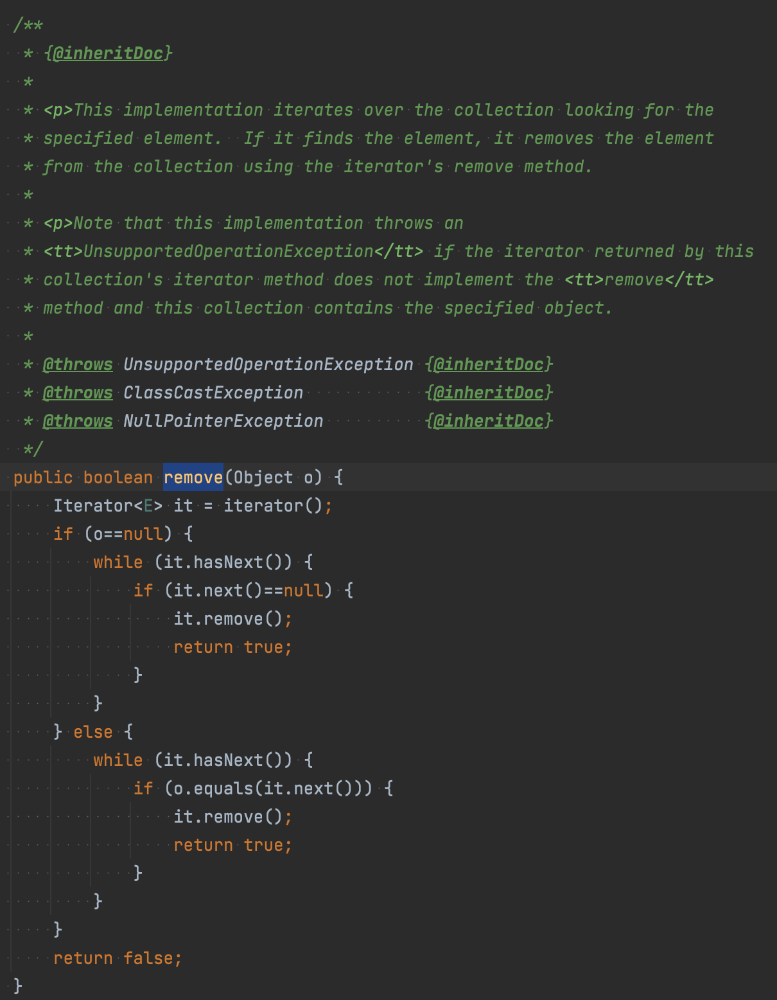
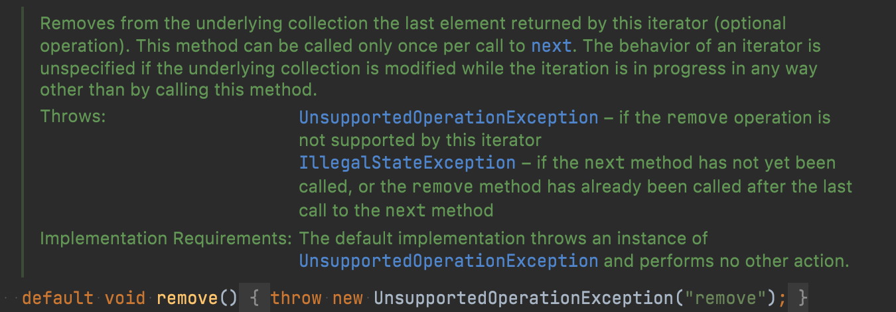
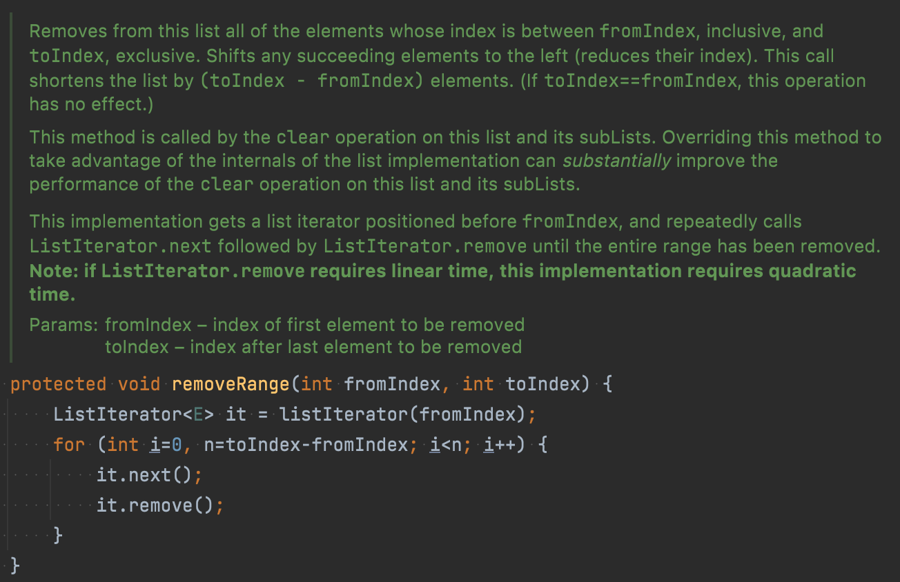
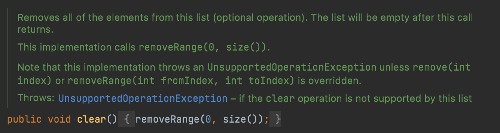

## [아이템 19] 상속을 고려해 설계하고 문서화하라. 그러지 않았다면 상속을 금지하라

### 상속을 고려한 설계와 문서화란?

1. **메서드를 재정의하면 어떤 일이 일어나는지 정확히 정리하여 문서로 남겨야한다.**

   즉, 상속용 클래스는 재정의할 수 있는 메서드를 내부적으로 어떻게 이용하는지 문서로 남겨야 한다.


만약 클래스의 API로 공개된 메서드에서 클래스 자신의 또 다른 메서드를 호출할 수도 있다. 그런데 마침 호출되는 메서드가 재정의 가능 메서드라면 그 사실을 호출하는 메서드의 API 설명에 적시해야 한다.

다음은 `java.util.AbstractCollection` 의 예이다.

- 이 메서드는 컬렉션을 순회하며 주어진 원소를 찾도록 구현되어있다. 주어진 원소를 찾으면 `Iterator`의 `remove` 메서드를 사용해 컬렉션에서 제거한다. 이 컬렉션이 주어진 객체를 갖고 있으나, 이 컬렉션의 `iterator` 메서드가 반환한 반복자가 `remove` 메서드를 구현하지 않았다면 `UnsupportedOperationException`을 던지니 주의하자.




- Iterator 인터페이스
    - implementaion Requirements를 확인하면 이 메서드의 내부 동작 방식을 설명해주는 것을 확인할 수 있음



이처럼 내부 메커니즘을 문서로 남기는 것만이 상속을 위한 설계의 전부는 아니다.

클래스의 내부 동작 과정 중간에 끼어들 수 있는 훅(hook)을 잘 선별하여 protected 메서드 형태로 공개해야할 수도 있다.

- AbstractList
  - removeRange



  - clear



  List 구현체의 최종 사용자는 `removeRange` 메서드에 관심이 없지만, 그럼에도 이 메서드를 제공한 이유는 단지 하위 클래스에서 부분 리스트의 clear 메서드를 고성능으로 만들기 위해서이다.

2. **상속용 클래스의 생성자는 직/간접적으로 모두 재정의 가능 메서드를 호출해서는 안된다.**

   상위 클래스의 생성자가 하위 클래스보다 먼저 실행되므로 하위 클래스에서 재정의한 메서드가 하위 클래스의 생성자보다 먼저 호출된다. 이때 재정의한 메서드가 하위 클래스의 생성자에서 초기화하는 값에 의존한다면 의도대로 동작하지 않을 것이다.


다음은 이 규칙을 어긴 예이다.

```java
public class Super {
	// 잘못된 예 - 생성자가 재정의 가능 메서드를 호출한다.
  public Super() {
		overrideMe();
	}

	public void overrideMe() {}
}
```

```java
public final class Sub extends Super {
	// 초기화되지 않는 final 필드, 생성자에서 초기화한다.
	private final Instant instant;

  Sub() {
		instant = Instant.now();
	}

	// 재정의 가능 메서드. 상위 클래스의 생성자가 호출된다.
	@Override public void overrideMe() {
		System.out.println(instant);
	}

	public static void main(String[] args) {
		Sub sub = new Sub();
		sub.overrideMe();
	}
}

// output
null
2022-02-12T07:05:19.667Z
```

이 프로그램에서 instant를 두 번 출력할 것이라 기대했지만 실제로는 첫번째는 null 필드를 출력했다.

그 이유는 상위 클래스의 생성자는 하위 클래스의 생성자가 인스턴스 필드를 초기화하기도 전에 `overrideMe`를 호출했기 때문이다. 

이와 같은 이유로 final로 선언한 `instant` 필드는 두 가지의 상태를 가지게 되었다.

만약 `overrideMe` 메서드를 private, final, static으로 정의했다면 메서드 재정의가 불가능하니 생성자에서 안심하고 호출해도 된다.

### 상속용으로 설계하지 않은 클래스는 상속을 금지하라.

상속을 금지하는 방법은 두가지가 있다.

1. **final로 클래스를 선언하라.**
2. **생성자 모두를 외부에서 접근할 수 없도록 만들어라.**
    - 모든 생성자를 private 혹은 package-private로 선언하고 public 정적 팩터리 사용

하지만 구체 클래스가 표준 인터페이스를 구현하지도 않았는데 상속을 금지하면 사용하기 힘든점이 있다. 이런 클래스라도 상속을 꼭 허용해야겠다면, 클래스 내부에서 재정의 가능 메서드를 사용하지 않게 만들고 이를 문서로 남기는 것이다, 즉, **재정의 가능 메서드를 호출하는 자기 사용 코드를 완벽히 제거하라**는 말이다.

이렇게 되면 메서드를 재정의해도 다른 메서드의 동작에 아무런 영향을 미치지 않기 때문에 상속을 해도 그리 위험하지 않은 클래스를 만들 수 있다.


### 참고
이펙티브 자바 3/E
