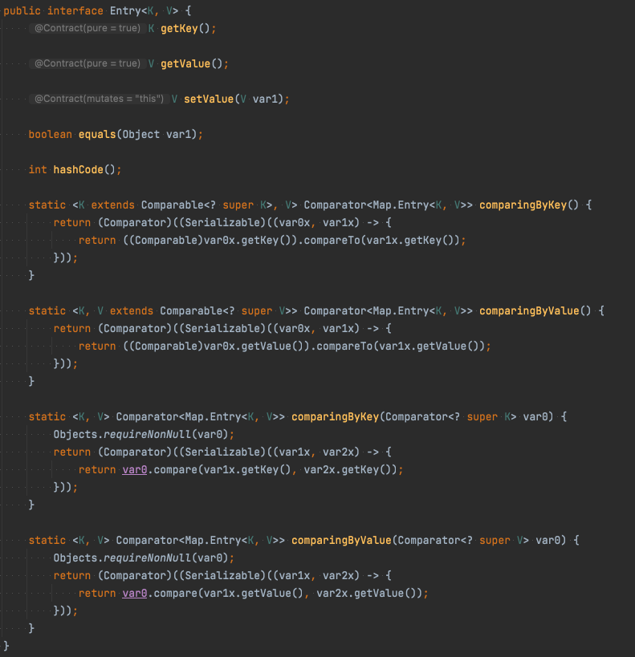

# [아이템 20] 추상 클래스보다는 인터페이스를 우선하라

자바 8 부터는 인터페이스에 default method를 제공하게 되어 인터페이스와 추상 클래스 모두 인스턴스 메서드를 구현 형태로 제공할 수 있게 되었다. 그렇다면 이 둘의 차이는 무엇일까?

### [추상클래스 vs 인터페이스](https://docs.oracle.com/javase/tutorial/java/IandI/abstract.html)

- 공통점 : 인스턴스화할 수 없으며 구현 여부에 상관없이 선언된 메서드가 혼합되어 포함될 수 있다.
- 차이점
    - 추상클래스 - static, final이 아닌 필드와 public, protected, private 메서드를 선언할 수 있다.
    - 인터페이스 - 모든 필드가 public, static, final이 되며 모든 메서드는 public이다.

그럼 추상 클래스보다 인터페이스를 우선해야하는 이유는 무엇일까?

1. **기존 클래스에도 손쉽게 새로운 인터페이스를 구현해넣을 수 있다.**

   자바에서는 단일 상속만 지원하기 때문에 한 추상 클래스를 상속받은 클래스는 다른 클래스를 상속받을 수 없는 반면 인터페이스는 클래스 선언에 implements만 추가하고, 해당 인터페이스가 요구하는 메서드를 구현하기만 하면 끝이다.

2. **인터페이스는 믹스인(mixin) 정의에 안성맞춤이다.**
    - 믹스인이란?
        - 대상 타입의 주된 기능에 선택적 기능을 ‘혼합’하는 것

   추상 클래스는 기존 클래스에 덧씌울 수 없기 때문에 믹스인을 정의할 수 없다. 자바의 단일 상속으로 클래스는 두 부모를 섬길 수 없고, 클래스 계층구조에는 믹스인을 삽입하기에 합리적인 위치가 없기 때문이다.

3. **인터페이스로는 계층구조가 없는 타입 프레임워크를 만들 수 있다.**

   현실에서는 계층을 엄격히 구분하기 어려운 개념이 존재한다.

   *작곡을 하는 가수인 싱어송라이터를 예시로 들어보자*.

   가수(Singer) 인터페이스와 작곡가(SongWriter) 인터페이스가 있다고 가정했을때,

    ```java
    public interface Singer {
    	AudioClip sing(Song s);
    }
    
    public interface SongWriter {
    	Song compose(int charPosition);
    }
    ```

   Singer와 SongWirter를 인터페이스로 정의했기 때문에 가수클래스가 Singer와 SongWriter 모두를 구현해도 전혀 문제가 되지 않는다.

    ```java
    public interface SingerSongWriter extends Singer, SongWriter {
    	AudioClip strum();
    	void actSensitive();
    }
    ```


4. **래퍼 클래스관용구와 함께 사용하면 인터페이스는 기능을 향상시키는 안전하고 강력한 수단이 된다.**

   타입을 추상 클래스로 정의해두면 그 타입에 기능을 추가하는 방법은 상속뿐으로, 상속해서 만든 클래스는 래퍼 클래스보다 활용도가 떨어지게 된다.

   인터페이스에서 디폴트 메서드를 제공하기 때문에 중복된 메서드를 구현하는 수고를 덜 수 있게 되었지만, 이런 디폴트 메서드에도 제약은 존재한다. [많은 인터페이스가 equals, hashCode 같은 Object의 메서드를 정의하고 있지만, 이를 디폴트 메서드로 제공해서는 안된다.](https://dzone.com/articles/why-default-method-cannot-override-objects-methods) 또한, 인터페이스는 인스턴스 필드를 가질 수 없고, public이 아닌 정적멤버도 가질 수 없다. 또한 자신이 만들지 않은 인터페이스에는 디폴트 메서드를 추가할 수 없다.

   한편, 인터페이스와 추상 골격 구현(skeletal implementation)를 함께 제공하는 식으로 인터페이스와 추상 틀래스의 장점을 모두 취하는 방법도 있다.

   인터페이스로는 타입을 정의하고, 필요하면 디폴트 메서드 몇 개도 함께 제공한다. 그리고 골격 구현 클래스는 나머지 메서드들까지 구현한다. 이러한 구현 방식이 바로 템플릿 메서드 패턴이다.

   > **템플릿 메서드 패턴**<br/>
   상속을 통해 슈퍼클래스의 기능을 확장할 때 사용하는 대표적인 방법으로 변하지 않는 기능은 슈퍼클래스에 만들어두고 자주 변경되며 확장할 기능은 서브 클래스에서 만들도록 한다.
   >

   **골격 구현 작성**

    - 인터페이스를 잘 살펴 다른 메서드들의 구현에 사용되는 기반 메서드들을 선정한다.
        - 이 기반 메서드들은 골격 구현에서는 추상 메서드가 될 것이다.
    - 기반 메서드들을 사용해 직접 구현할 수 있는 메서드를 모두 디폴트 메서드로 제공한다.
        - 단, equals와 hashcode 같은 Object의 메서드는 디폴트 메서드로 제공하면 안된다는 사실을 유념하자.
    - 만약 인터페이스의 메서드 모두가 기반 메서드와 디폴트 메서드가 된다면 골격 구현 클래스를 별도로 만들 필요는 없다.
        - 기반 메서드나 디폴트 메서드로 만들지 못한 메서드가 남아 있다면, 이 인터페이스를 구현하는 골격 구현 클래스를 하나 만들어 남은 메서드들을 작성해 넣는다.

   

```java
public abstract class AbstractMapEntry<K, V> implements Map.Entry<K, V> {
  @Override
  public abstract K getKey();

  @Override
  public abstract V getValue();

	// 변경 가능한 엔트리는 이 메서드를 반드시 재정의해야 한다.
  @Override
  public V setValue(V value) {
    throw new UnsupportedOperationException();
  }

	// Map.Entry.equals의 일반 규약을 구현한다.
  @Override
  public boolean equals(@Nullable Object object) {
		if (o == this) {
			return true;
		}
    if (!(object instanceof Entry)) {
      return false;
    }
		Map.Entry<?, ?> that = (Map.Entry) object;
      return Objects.equal(getKey(), that.getKey())
          && Objects.equal(getValue(), that.getValue());
  }

	// Map.Entry.hashCode의 일반 규약을 구현한다.
  @Override
  public int hashCode() {
    return Objects.hashCode(getKey())
			^Objects.hashCode(getValue());
  }

  @Override
  public String toString() {
    return getKey() + "=" + getValue();
  }
}
```

**시뮬레이트한 다중 상속(simulated multiple inheritance)**

골격 구현 클래스를 우회적으로 이용하는 방식으로 인터페이스를 구현한 클래스에서 확장한 private 내부 클래스를 정의하고 각 메서드 호출을 내부 클래스의 인스턴스에 전달한다. 이는 아이템 18에서 다룬 래퍼 클래스와 비슷하다.

### 정리
일반적으로 다중 구현용 타입으로는 인터페이스가 가장 적합하다. 골격 구현은 ‘가능한 한' 인터페이스의 디폴트 메서드로 제공하여 그 인터페이스를 구현한 모든 곳에서 활용할 수 있도록 하는 것이 좋다. 여기서 ‘가능한 한'이라고 한 이유는, 인터페이스의 구현상의 제약 때문에 골격 구현을 추상 클래스로 제공하는 경우가 더 흔하기 때문이다.

## 참고

- [https://docs.oracle.com/javase/tutorial/java/IandI/abstract.html](https://docs.oracle.com/javase/tutorial/java/IandI/abstract.html)
- 디폴트 메서드에서 Object의 메서드를 제공하면 안되는 이유
    - [https://dzone.com/articles/why-default-method-cannot-override-objects-methods](https://dzone.com/articles/why-default-method-cannot-override-objects-methods)
    - [http://mail.openjdk.java.net/pipermail/lambda-dev/2013-March/008435.html](http://mail.openjdk.java.net/pipermail/lambda-dev/2013-March/008435.html)
