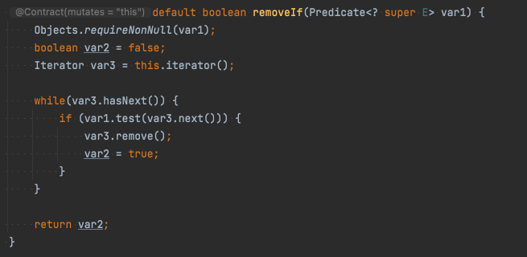
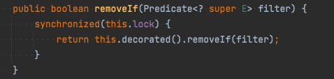

# [아이템 21] 인터페이스는 구현하는 쪽을 생각해 설계하라

> **자바 8 이후 디폴트 메서드라는 도구가 생겼지만 인터페이스를 설계할 때는 여전히 세심한 주의를 기울여야 한다.**
> 

1. **생각할 수 있는 모든 상황에서 불변식을 해치지 않는 디폴트 메서드를 작성하기란 어려운 법이다.**

자바 8의 Collection 인터페이스에 추가된 `removeIf` 메서드를 예로 들어보자.

`removeIf` 메서드는 과연 모든 Collection 구현체와 잘 어우러졌을까?

→ `org.apache.commons.collections4.collection.SynchronizedCollection`에서 문제를 찾을 수 있다.

아파치 커먼즈 라이브러리의 이 클래스는 `java.util`의 `Collections.synchronizedCollection` 정적 팩토리 메서드가 반환하는 클래스와 비슷하지만 클라이언트가 제공한 객체로 락을 거는 능력을 추가로 제공한다. 즉, 모든 메서드에서 주어진 락 객체로 동기한 후 내부 컬렉션 객체에 기능을 위임하는 wrapper 클래스다.

이 클래스는 이펙티브 자바 책이 작성되었던 시점에는 `removeIf` 메서드를 재 정의 를 하지 않아 모든 메서드 호출을 알아서 동기화해주지 못했다. 따라서 `SynchronizedCollection` 인스턴스를 여러 스레드가 공유하는 환경에서 한 스레드가 `removeIf`를 호출하면 `ConcurrentModificationException`이 발생하거나 다른 예기치 못한 결과로 이어질 수 있다.

- `SynchronizedCollection` 에 재정의된 `removeIf` 메서드 (현시점)

1. **디폴트 메서드는 컴파일에 성공하더라도 기존 구현체에 런타임 오류를 일으킬 수 있다.**

기존 인터페이스에 디폴트 메서드로 새 메서드를 추가하는 일은 곡 필요한 경우가 아니면 피해야 한다.

자바 8은 컬렉션 인터페이스에 꽤 많은 디폴트 메서드를 추가했고, 그 결과 기존에 짜여진 많은 자바 코드가 영향을 받았던 것으로 알려졌다. 추가하려는 디폴트 메서드가 기존 구현체들과 충돌하지 않을지 심사숙고해야 함도 당연하다.

반면, 새로운 인터페이스를 만드는 경우라면 표준적인 메서드 구현을 제공하는 데 아주 유용한 수단이며, 그 인터페이스를 더 쉽게 구현해 활용할 수 있게끔 해준다.
