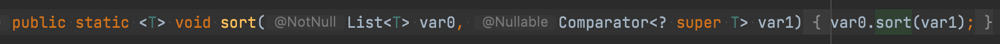
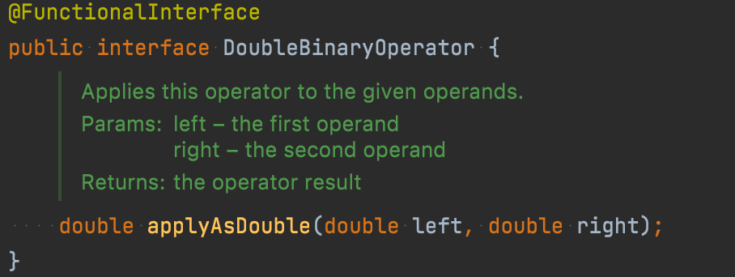
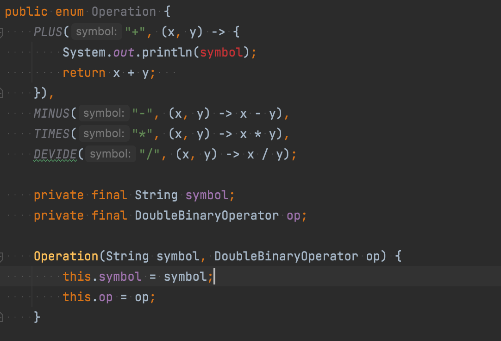
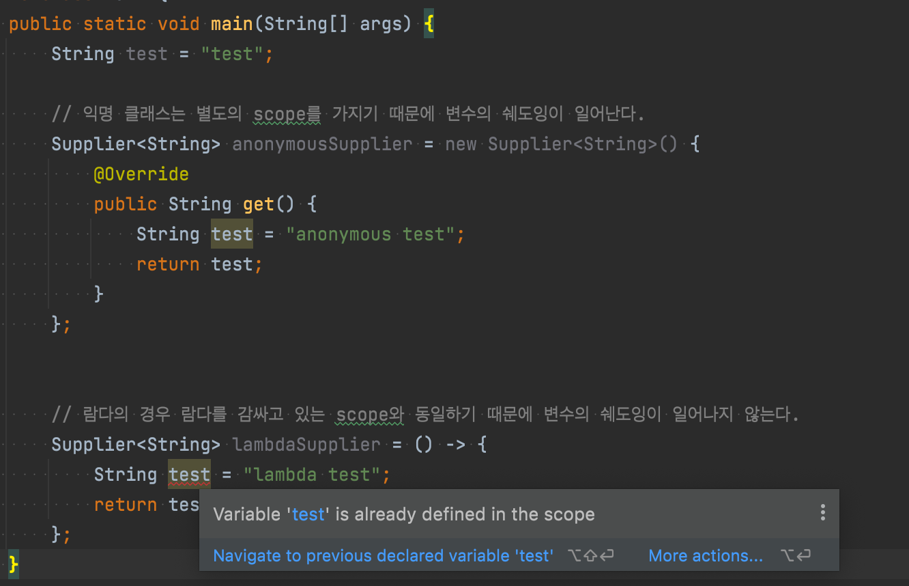

# [아이템 42] 익명 클래스보다는 람다를 사용하라

**익명 클래스**

- 클래스를 선언하고 동시에 인스턴스화할 수 있다.
- 이름이 없다는 것을 제외하면 로컬 클래스와 같다.
- 로컬 클래스를 한번만 사용해야하는 경우 적합
- 프로그램에서 일시적으로 한번만 사용되고 버려지는 객체

```java
Collections.sort(words, new Comparator<String>() {
    public int compare(String s1, String s2) {
        return Integer.compare(s1.length(), s2.length());
    }
}
```

전략패턴처럼, 함수 객체를 사용하는 과거 객체 지향 디자인 패턴에는 익명 클래스면 충분했다.

이 코드에서는 Comparator 인터페이스가 정렬을 담당하는 추상 전략을 뜻하며, 문자열을 정렬하는 구체적인 전략을 익명클래스로 구현했다. 하지만 익명 클래스 방식은 코드가 너무 길기 때문에 자바는 함수형 프로그래밍에 적합하지 않았다.

**함수형 인터페이스**

> 추상 메서드가 단 하나 있는 인터페이스
>

Java 8부터 이 함수형 인터페이스들의 인스턴스를 람다식을 사용해 만들 수 있게 되었다.

```java
Collections.sort(words,
    (s1, s2) -> Integer.compare(s1.length(), s2.length());
}
```

람다에서는 컴파일러가 대신 타입을 추론하기 때문에 매개변수나 반환타입을 직접 지정할 필요가 없다.

컴파일러가 타입을 추론할 때 필요한 정보는 대부분 제네릭을 통해 얻는다.



위의 코드는 비교자 생성 메서드를 사용하면 더 간결하게 만들 수 있다.

```java
Collections.sort(words, comparingInt(String::length));
```

자바 8의 List 인터페이스에 추가된 sort 메서드를 이용하면 더욱 간결해진다.

```java
words.sort(ComparingInt(String::length));
```

이전 아이템에서 살펴본 Operation 열거 타입의 예시를 살펴보자.

```java
public enum Operation {
  PLUS("+") {
    public double apply(double x, double y) { return x + y; }
  }
  MINUS("-") {
	  public double apply(double x, double y) { return x - y; }
  }
  TIMES("*") {
		public double apply(double x, double y) { return x * y; }
	}
	DIVIDE("/") {
		public double apply(double x, double y) { return x / y; }
	}

	private final String symbol;

	Operation(String Symbol) { this.symbol = symbol; }
	
	@Override public String toString() { return symbol; }

	public abstract double apply(double x, double y);
}
```

-

위 코드는 enum 타입에 apply라는 추상 메서드를 선언하고 각 상수에서 자신에 맞게 apply 메서드를 재정의한 형태이다.


람다를 사용하면 위처럼 상수별 클래스 몸체를 구현하는 방식보다는 열거 타입에 인스턴스 필드를 둘 수 있다.

클래스 몸체를 구현하는 방식보다 짧고 보기 편한 코드가 되었다.

```java
public enum Operation {
	PLUS("+", (x, y) -> x + y),
	MINUS("-", (x, y) -> x - y),
	TIMES("*", (x, y) -> x * y),
	DEVIDE("/", (x, y) -> x / y);

	private final String symbol;
	private final DoubleBinaryOperator op;

	Operation(String symbol, DoubleBinaryOperator op) {
		this.symbol = symbol;
		this.op = op;
	}

	@Override public String toString() { return symbol; }

	public double apply(double x, double y) {
		return op.applyAsDouble(x, y);
}
```

- DoubleBinaryOperator

  Double 타입의 인자 두개를 받고, 동일한 Double 객체를 리턴하는 함수형 인터페이스


  

**람다 사용시 주의할 점**

1. 람다는 이름이 없고, 문서화도 하지 못하기 때문에, 코드 자체로 동작이 명확히 설명되지 않거나 코드 줄 수가 많아지면 람다를 쓰지 말아야 한다.
2. 열거 타입 생성자에 넘겨지는 인수들의 타입도 컴파일시점에 추론되기 때문에, 열거 타입 생성자 안의 람다는 인스턴스 멤버에 접근할 수 없다. (인스턴스는 런타임에 생성)

  

**그렇다면 익명클래스는 이제 사용이 되지 않을까? [No]**

- 추상 클래스의 인스턴스를 만들 때 람다를 사용할 수 없으니, 익명 클래스를 사용해야 한다.
- 비슷하게 추상 메서드가 여러 개인 인터페이스의 인스턴스를 만들 때도 익명 클래스를 쓸 수 있다.
- 마지막으로, 람다는 자신을 참조할 수 없다.
    - 람다에서의 this 키워드는 바깥 인스턴스를 가리킨다.
    - 반면, 익명 클래스에서의 this는 익명 클래스의 인스턴스 자신을 가리킨다.
    - 그러므로 함수 객체가 자기 자신을 참조해야한다면 반드시 익명 클래스를 사용해야 한다.

**람다 scope**



### 한줄 정리

익명 클래스는 (함수형 인터페이스가 아닌) 타입의 인스턴스를 만들때만 사용하라.

## 참고

[https://docs.oracle.com/javase/tutorial/java/javaOO/anonymousclasses.html](https://docs.oracle.com/javase/tutorial/java/javaOO/anonymousclasses.html)
