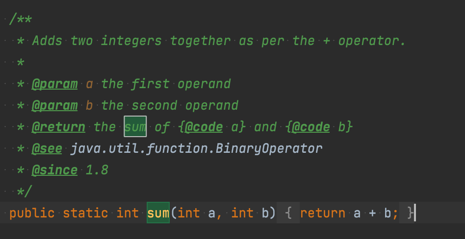

# [아이템 43] 람다보다는 메서드 참조를 사용하라

람다가 익명클래스보다 더 나은 점 중에서 가장 큰 특징이 있다면 간결함일 것이다.

이런 람다보다 더 간결하게 만들 수 있는 방법은 **메서드 참조(method reference)**이다.

다음 예시로 살펴보자.

```java
map.merge(key, 1, (count, incr) -> count + incr);
```


위의 코드도 충분히 깔끔해 보일 수 있지만 매개변수인 count와 incr은 크게 하는 일 없이 공간을 꽤 차지하고 있다.


자바 8에서 Integer 클래스에서 위 람다와 기능이 같은 정적 메서드 sum을 제공하기 시작했다.

따라서 람다 대신 메서드 참조를 전달하면 코드를 더 간결하게 작성할 수 있다.

```java
map.merge(key, 1, Integer::sum);
```

### 메서드 참조 유형

| 스태틱 메서드 참조 | 타입::스태틱 메서드 | Integer::parseInt |
| --- | --- | --- |
| 특정 객체의 인스턴스 메서드 참조(한정적) | 객체 레퍼런스::인스턴스 메서드 | Instant.now()::isAfter |
| 임의 객체의 인스턴스 메서드 참조(비한정적) | 타입::인스턴스 메서드 | String::toLowerCase |
| 생성자 참조 | 타입::new | TreeMap<K,V>::new |

### 한줄 정리

람다보다 메서드 참조 쪽이 짧고 명확하다면 메서드 참조를 쓰고, 그렇지 않을때만 람다를 사용하라
