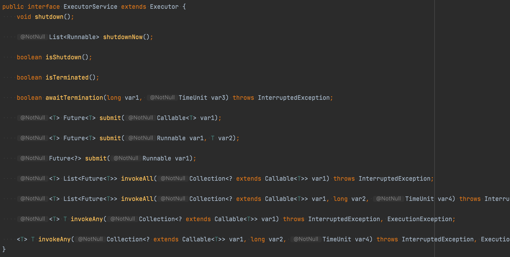

# [아이템 44] 표준 함수형 인터페이스를 사용하라

> 필요한 용도에 맞는게 있다면, 직접 구현하지 말고 표준 함수형 인터페이스를 활용하라
>

| 인터페이스 | 함수 시그니처 | 예 |
| --- | --- | --- |
| UnaryOperator<T> | T apply(T t) | String::toLowerCase |
| BinaryOperator<T> | T apply(T t1, T t2) | BigInteger::add |
| Predicate<T> | Boolean test(T t) | Collection::isEmpty |
| Function<T, R> | R apply(T t) | Arrays::asList |
| Supplier<T> | T get() | Instant::now |
| Consumer<T> | void accept(T t) | System.out::println |

### 인터페이스 변형

기본 인터페이스는 기본 타입인 `int`, `long`, `double` 용으로 각 3개씩 변형이 생겨난다.

그 이름도 기본 인터페이스의 이름 앞에 해당 기본 타입 이름을 가지고 있다.

- int를 받는 Predicate : IntPredicate
- long을 받아 long을 반환하는 BinaryOperator: LongBinaryOperator

**Function**

이 변형들 중 유일하게 `Function` 의 변형만 매개변수화 되었다.

- LongFunction<int[]> : long을 인수로 받아 int[]를 반환

`Function` 인터페이스에는 기본 타입을 반환하는 변형 9개나 더 있다.

인수와 같은 타입을 반환하는 `UnaryOperator`가 있으므로, `Function`인터페이스의 변형은 항상 입력과 결과 타입이 다르다.

입력과 결과 타입이 모두 기본형 타입이면 접두어로 `SrcToResult`를 사용한다.

- LongToIntFunction : long을 받아 int를 반환

나머지는 입력이 객체 참조이고 결과가 int, long, double인 변형이다.

- ToLongFunction<int[]> : int[] 인수를 받아 long을 반환

**인수를 두개씩 받는 변형**

- `BiPredicate<T, U>`, `BiFunction<B,U,R>`, `BiConsumer<T, U>`
- `BiFunction`에는 다시 기본 타입을 반환하는 세 변형이 존재한다.
    - `ToIntBiFuntion<T, U>`, `ToLongBiFuntion<T, U>`, `ToDoubleBiFuntion<T, U>`
- `BiConsumer`에도 객체 참조와 기본 타입 하나, 즉 인수를 2개 받는 변형이 존재한다.
    - `ObjIntConsumer<T>`, `ObjLongConsumer<T>`, `ObjDoubleConsumer<T>`

마지막으로 `BooleanSupplier` 인터페이스는 boolean을 반환하도록 한 `Supplier`의 변형이다.

이렇게 알아본 표준 함수형 인터페이스는 총 43개이다.

솔직히 외우기엔 수도 많고 규칙성도 부족하지만, 실무에서 자주 쓰이는 함수형 인터페이스 중 상당수를 제공하며, 필요할 때 찾아 쓸 수 있을 만틈은 범용적인 이름을 사용하고 있다.

**그렇다면, 구조적으로 똑같은 표준 함수형 인터페이스가 있더라도 직접 작성하는 것이 좋은 경우는 어떤 경우일까?**

`Comparator<T>` 인터페이스를 예시로 살펴보자.

구조적으로는 `ToIntBiFunction<T, U>`와 동일하다.

```java
// Comparator<T>
@FunctionalInterface
public interface Comparator<T> {
	int compare(T o1, T o2);
}

// ToIntBiFunction
@FunctionalInterface
public interface ToIntBiFunction<T, U> {

    int applyAsInt(T t, U u);
}
```

`Comparator`가 독자적인 인터페이스로 살아남아야하는 이유는 다음과 같다.

1. API에서 굉장히 자주 사용되는데, 지금의 이름이 그 용도를 아주 훌륭히 설명해준다.
2. 구현하는 쪽에서 반드시 지켜야 할 규약을 담고 있다.
3. 비교자를 변환하고 조합해주는 유용한 디폴트 메서드를 듬뿍 담고 있다.

이와 같은 특성들을 정리하면 다음의 세 가지 조건이 나온다. 이 중 하나 이상을 만족한다면 전용 함수형 인터페이스를 구현해야하는 것은 아닌지 신중히 고민해야 한다.

- 자주 쓰이며, 이름 자체가 용도를 명확히 설명해준다.
- 반드시 따라야 하는 규약이 있다.
- 유용한 디폴트 메서드를 제공할 수 있다.

또한, 직접 만든 함수형 인터페이스에는 항상 `@FunctionalInterface` 애너테이션을 사용해야한다.

이 애너테이션을 사용하는 이유는 다음과 같다.

1. 해당 인터페이스가 람다용으로 설계된 것임을 알려준다.
2. 해당 인터페이스가 추상 메서드를 오직 하나만 가지고 있어야 컴파일되게 해준다.
3. 그 결과 유지보수 과정에서 누군가 실수로 메서드를 추가하지 못하게 막아준다.

**함수형 인터페이스 API에서 사용할 때의 주의점**

서로 다른 함수형 인터페이스를 같은 위치의 인수로 받는 메서드들을 다중 정의해서는 안된다.

이는 클라이언트들에게 불필요한 모호함만 안겨줄 뿐이며, 이 모호함으로 인해 실제로 문제가 일어나기도 한다.



`ExecutorService`의 `submit`메서드에서는 `Callable<T>`을 받는 것과 `Runnable`를 받는 것을 다중정의했다. 덕분에 올바른 메서드를 알려주기 위해 형변환해야할 때가 왕왕 생겼다.

이런 문제를 피하는 가장 쉬운 방법은 서로 다른 함수형 인터페이스를 같은 위치의 인수로 사용하는 다중 정의를 피하는 것이다.

### 한줄 정리

API를 설계할 때 람다도 염두해 두어야 한다. 입력값과 반환값에 함수형 인터페이스 타입을 활용하라. 보통은 표준 함수형 인터페이스를 사용하는 것이 가장 좋은 선택이다.
