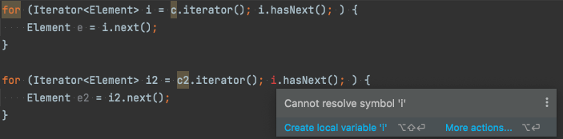

# [아이템 57] 지역변수의 범위를 최소화하라

> **지역변수의 유효 범위를 최소로 줄이면 코드 가독성과 유지보수성이 높아지고 요류 가능성은 낮아진다.**
>

C 언어의 경우 지역변수를 코드 블록의 첫 머리에 선언하는 경우가 많고, 이 방식을 여전히 습관처럼 따르는 프로그래머들도 있다.

```c
#include<stdio.h>

int main() {
	// 지역변수 코드 첫블록에서 초기화
	int a = 0;
	int b = 1;
	int c = 2;

	// 다른 로직이 있다고 가정
	// ...

	printf("a + b + c = %d", a + b + c);
}

	
```

### 지역변수의 범위를 줄이는 가장 강력한 기법은 역시 ‘**가장 처음 쓰일 때 선언하기**'이다.

지역변수의 범위는 선언된 지점부터 그 지점을 포함한 블록이 끝날 때까지이므로, 실제 사용하는 블록 바깥에 선언된 변수는 그 블록이 끝난 뒤까지 살아있게 된다.

### **거의 모든 지역변수는 선언과 동시에 초기화**해야 한다.

초기화에 필요한 정보가 충분하지 않다면 충분해질 때까지 선언을 미뤄야한다.

단, 여기서 try-catch문은 이 규칙에서 예외이다. 변수를 초기화하는 표현식에서 검사 예외를 던질 가능성이 있다면 try 블록에서 초기화해야 한다. 한편, 변수 값을 try 블록 바깥에서도 사용해야한다면 try 블록 앞에서 선언해야 한다.

```java
// 변수 값을 try 블록 바깥에서도 사용하는 경우
Map<String, Map<String, Boolean>> subscriptionStatus;
try {
	subscriptionStatus = objectMapper.readValue(multiRedisTemplate.opsForRead().hget(NOTICE_SUBSCRIPTION.createKey(serviceId), userId), Map.class);
} catch (IllegalArgumentException e) {
	subscriptionStatus = new HashMap<>();
} catch (IOException e) {
	throw new PastaException(HttpStatus.INTERNAL_SERVER_ERROR, "get notice subscription convert error", e);
}
```

반복문의 경우 독특한 방식으로 변수 범위를 최소화해준다.

반목문(for, for-each)의 경우 반복 변수(loop variable)의 범위가 반복문의 몸체, 그리고 for 키워드와 몸체 사이의 괄호 안으로 제한된다. 따라서 반복 변수의 값을 반복문이 종료된 뒤에도 써야 하는 상황이 아니라면 while 문보다는 for 문을 쓰는 편이 낫다.

```java
// 컬레션을 순회할 때 권장하는 관용구
for (Element e : c) {
	// ...
}
```

반복자를 사용해야 하는 경우라면 (반복자의 remove 메서드를 써야 한다거나...) for-each보다는 for문을 쓰는 것이 낫다.

```java
for (Iterator<Element> i = c.iterator(); i.hasNext();) {
	Element e = i.next();
}
```

다음 두 while문을 본다면 위의 for문이 나은 이유를 알 수 있다.

```java
Iterator<Element> i = c.iterator();
while (i.hasNext()) {
	doSomething(i.next());
}

Iterator<Element> i2 = c2.iterator();
while (i.hasNext()) {  // 버그
	doSomething(i2.next());
}
```

이 코드에서는 버그가 하나 있다.

바로 첫 번째 while 문을 복사해 붙여넣기 하는 과정에서 두 번째 while문의 실행 조건을 수정하지 않은 것이다.

이 코드가 실행되는 블록 안에서는 i의 유효 범위가 끝나지 않았으므로, 이 코드는 컴파일도 잘되고 런타임 시에 예외도 던지지 않는다.

프로그램 오류가 겉으로 드러나지 않으니 오랜 기간 발견되지 않을 수 있다.

while 문은 이런 버그를 발생시킬 수 있는 반면, for문을 사용하면 복사/붙여넣기 오류를 컴파일 시에 잡아준다.

첫 번째 반복문이 사용한 원소와 반복자의 유효 범위가 반복문 종료와 함께 끝나기 때문이다.



또한, for문을 사용할 경우 변수 유효 범위가 for 문 범위와 일치하여 똑같은 이름의 변수를 여러 반복문에서 사용하더라도 서로 아무런 영향을 주지 않는다.

다음은 지역변수의 범위를 최소화하는 또 다른 반복문 관용구이다.

```java
// 첫 번째
for (int i = 0; i < expensiveComputation(); i++) {
	// ...
}

----
// 두 번째
int n = expensiveComputation();
for (int i = 0; i < n; i++) {
	// ...
}

----
// 세 번째
for (int i = 0, n = expensiveComputation(); i < n; i++) {
	// ...
}
```

1. 첫 번째 코드의 문제점은 반복이 실행될 때마다 `expensiceComputation()`이 매번 실행된다.
2. 두 번째 코드의 문제점은 `expensiveCoumputation()`은 한 번만 실행이 되나 변수 n이 반복문이 종료되어도 살아 있다.
3. 세 번째 코드의 경우 반복 여부를 결정짓는 변수 i의 한곗값을 변수 n에 저장하여, 반복 때마다 다시 계산해야 하는 비용을 없애고, n의 유효범위도 반복문이 종료될 때 함께 종료된다.

같은 값을 반환하는 메서드를 매번 호출한다면 이 관용구를 사용하기를 바란다.

### 지역변수 범위를 최소화하는 마지막 방법은 **메서드를 작게 유지하고 한 가지 기능에 집중하는 것**이다.

한 메서드에서 여러 가지 기능을 처리한다면 그중한 기능과만 관련된 지역변수라도 다른 기능을 수행하는 코드에서 접근할 수 있을 것이다.
