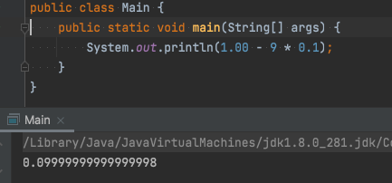
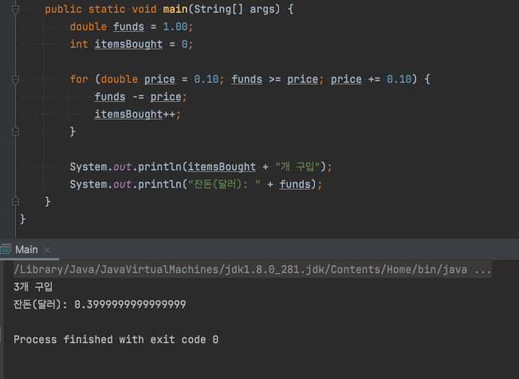
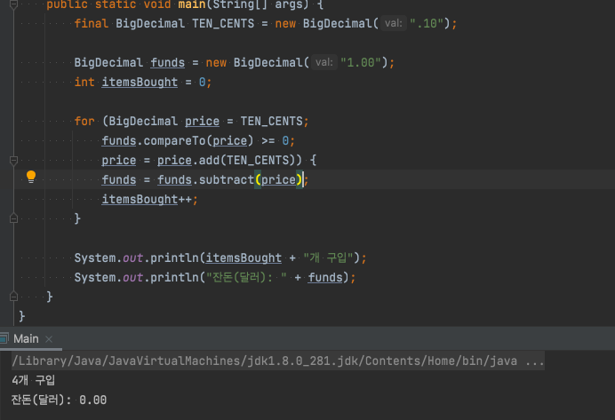

# [아이템 60] 정확한 답이 필요하다면 float과 double은 피하라.

float과 double은 과학과 공학 계산용으로 설계되었다. 따라서 정확한 결과가 필요할 때는 사용하면 안 된다. (근사치를 계산하도록 설계됨)

float과 double 타입은 특히 금융 관련 계산과는 맞지 않는다.

이 코드의 결과값으로 0.1을 기대하지만 기대와 전혀 다른 값이 나오는 것을 확인할 수 있다.

다른 예제를 살펴보자.

주머니에는 1달러가 있고, 선반에는 10센트, 20센트, 30센트, ... 1달러짜리의 사탕이 놓여있다고 가정했을 때, 10센트짜리부터 하나씩 산다면 사탕을 몇개나 살 수 있고 잔돈은 얼마가 남을까?

이 프로그램을 실핵한다면 사탕을 3개 구입하고 잔돈은 0.3999999999999999달러가 남는다.

이 문제를 올바르게 해결하려면 금융 계산에서는 BigDecimal과 int 혹은 long을 사용해야 한다,

- 참고 : 계산 시 부정확한 값이 사용되는 걸 막기 위해 BigDecimal의 생성자 중 문자열을 사용하는 생성자를 사용했다.

이 프로그램을 실행하면 사탕 4개를 구매한 후 잔돈은 0달러가 남는다.

올바른 답을 구했지만 BigDecimal을 사용할 경우 두 가지 단점이 존재한다.

첫 번째 단점은 기본 타입보다 쓰기가 훨씬 불편하다는 것이고,

두 번째 단점은 훨씬 느리다는 것이다.

BigDecimal의 대안으로 int나 long 타입을 쓸 수도 있다. 단, 다룰 수 있는 값의 크기가 한정되고 소수점을 직접 관리해야 한다.
