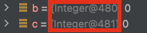
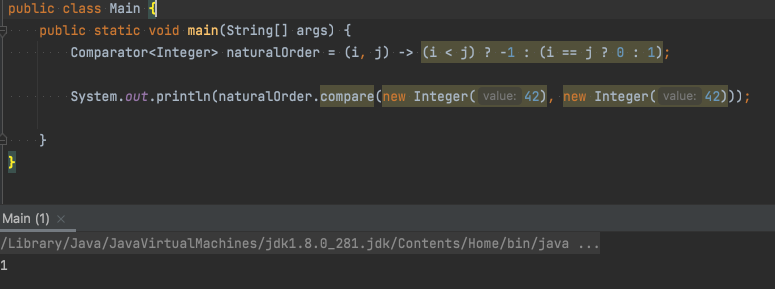

# [아이템 61] 박싱된 기본 타입보다는 기본 타입을 사용하라

# 기본 타입 vs 박싱된 기본 타입

| 참조타입 | 기본 타입 | 박싱된 기본 타입 |
| --- | --- | --- |
| String | int | Integer |
| List | double | Double |
|  | boolean | Boolean |

### 기본 타입과 박싱된 기본 타입의 차이점

1. 기본 타입은 값만 가지고 있으나, 박싱된 기본 타입은 값에 더해 식별성(identity)란 속성을 갖는다.



- 박싱된 기본 타입의 두 인스턴스는 값이 같아도 서로 다르다고 식별될 수 있다.
2. 기본 타입의 값은 언제나 유효하나, 박싱된 기본 타입은 유효하지 않은 값, 즉 null을 가질 수 있다.
3. 기본 타입이 박싱된 기본 타입보다 시간과 메모리 사용면에서 더 효율적이다.

**아래 코드의 문제점을 찾아보자.**

```java
Comparator<Integer> naturalOrder = 
		(i, j) -> (i < j) ? -1 : (i == j ? 0 : 1);
```

얼핏보면 아무런 문제가 없어 보이지만, `naturalOrder.compare(new Integer(42), new Integer(42))`의 값을 출력해보면 예상 외의 결과를 얻을 수 있다.

- 

이 문제를 해결하려면 지역변수 2개를 두어 각각 박싱된 Integer 매개변수의 값을 기본 타입 정수로 저장한 다음, 모든 비교를 이 기본 타입 변수로 수행해야 한다.

```java
Comparator<Integer> naturalOrder = (iBoxed, jBoxed) -> {
		int i = iBoxed, j = jBoxed; // 오토박싱
		return (i < j) ? -1 : (i == j ? 0 : 1);
}
```

또 다른 예제를 살펴보자.

아래 코드를 실행하면 어떤 결과가 나타날지 예상이 되는가?

```java
public class Unbelievable {
	static Integer i;
	public static void main(String[] args) {
		if (i == 42) {
			System.out.println("믿을 수 없군!");
		}
	}
}
```

- Solution

  이 프로그램을 NPE가 발생하게 된다.

  기본 타입과 박싱된 기본 타입을 혼용한 연산에서는 박싱된 기본 타입의 박싱이 자동으로 풀린다.

  그리고 null 참조를 언박싱하면 `NullPointException`이 발생한다


### 그럼 박싱된 기본 타입은 언제 써야 할까?

1. 컬렉션의 원소 키, 값으로 쓴다.

   컬렉션은 기본 타입을 담을 수 없으므로 어쩔 수 없이 박싱된 기본 타입을 써야한다.

   (Java에서는 타입 매개변수로 기본 타입을 지원하지 않기 때문에 매개변수화 타입이나 매개변수화 메서드의 타입 매개변수로는 박싱된 기본 타입을 써야한다. - 5장 제네릭 참고)

2. 리플렉션을 통해 메서드를 호출할 때도 박싱된 기본 타입을 사용해야 한다.
