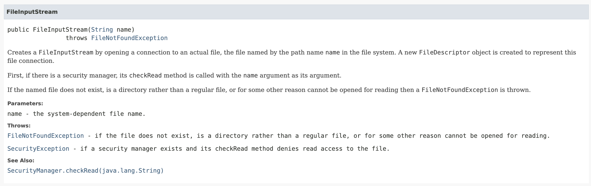
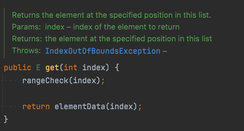

# [아이템 74] 메서드가 던지는 모든 예외를 문서화하라

### 검사 예외(Checked Exception)는 @throws 태그를 사용해 문서화하라


[그림 1] @throws를 이용한 Java doc (출처 - [https://docs.oracle.com/javase/8/docs/api/java/io/FileInputStream.html](https://docs.oracle.com/javase/8/docs/api/java/io/FileInputStream.html))

검사 예외는 항상 따로따로 선언하고, 각 예외가 발생하는 상황을 자바독의 @throws 태그를 사용하여 정확히 문서화하자.

극단적인 예로 메서드가 Exception이나 Throwable을 던진다고 선언해서는 안된다.

```java
public void method() throws Exception {
    // ...
}
```

이는 메서드 사용자에게 각 예외에 대처할 수 있는 힌트를 주지 못할뿐더러, 같은 맥락에서 발생할 여지가 있는 다른 예외들까지 모두 삼켜버릴 수 있어 API 사용성을 크게 떨어뜨린다.

### 비검사 예외(UnChecked Exception)도 문서화 해두면 좋다



[그림 2] 비검사 예외를 문서화한 ArrayList Java doc

비검사 예외를 문서화한다면 프로그래머는 해당 오류가 나지 않도록 코딩할 수 있다.

잘 정비된 비검사 예외 문서는 사실상 그 메서드를 성공적으로 수행하기 위한 전제조건이 된다.

단, 비검사 예외일 경우에는 메서드 시그니처에는 추가하지 말자

→ **메서드가 던질 수 있는 예외를 각각 @throws 태그로 문서화하되, 비검사 예외는 메서드 선언의 throws 목록에 넣지 말자.**

### 클래스 문서화 주석에 @throws를 사용할 수 있다.

한 클래스에 정의된 많은 메서드가 같은 이유로 같은 예외를 던진다면 그 예외를 클래스 설명에 추가할 수 있다.
