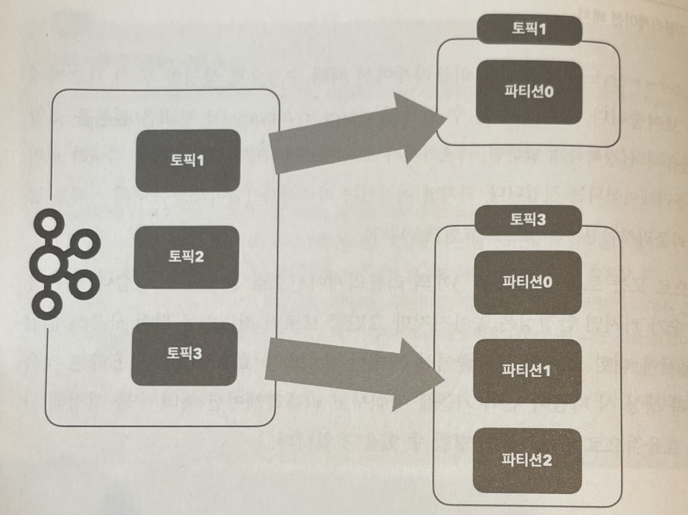
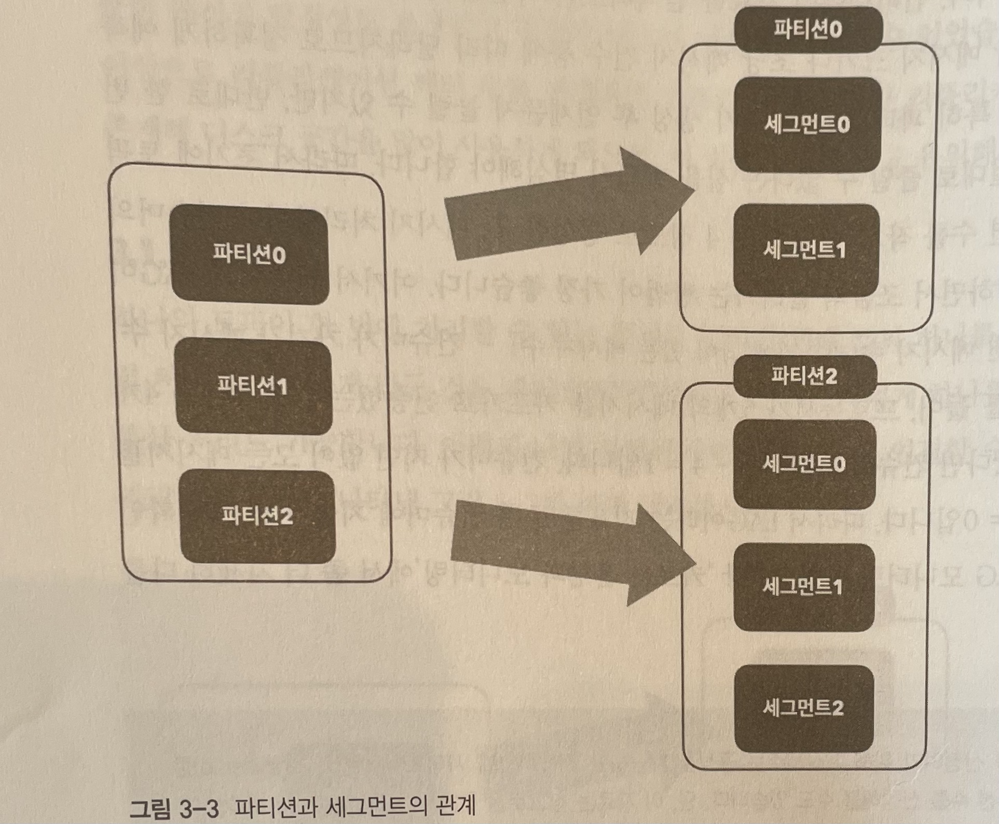
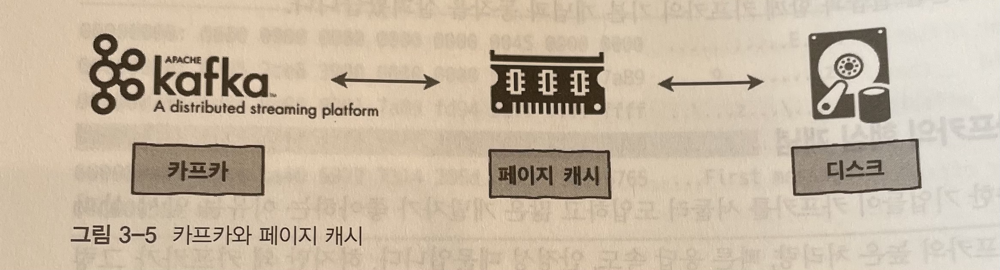
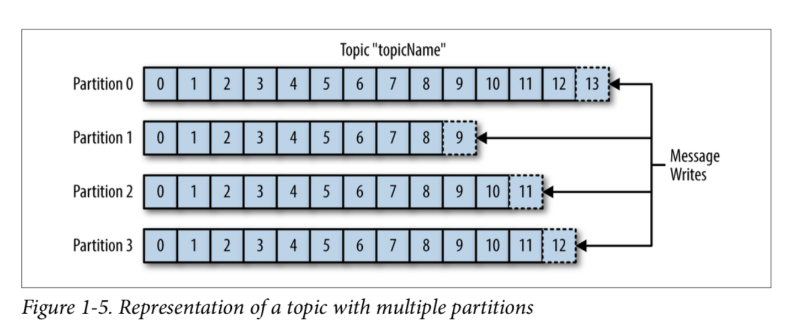
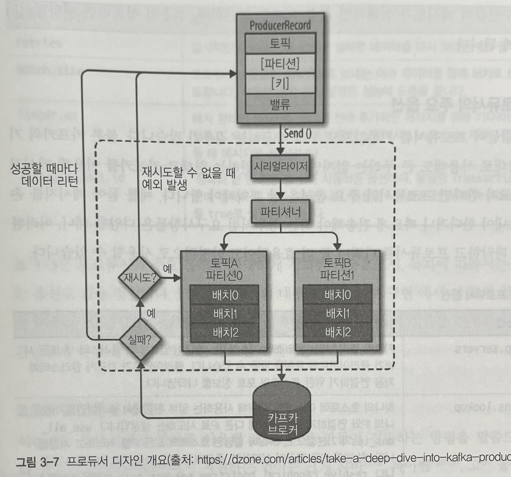
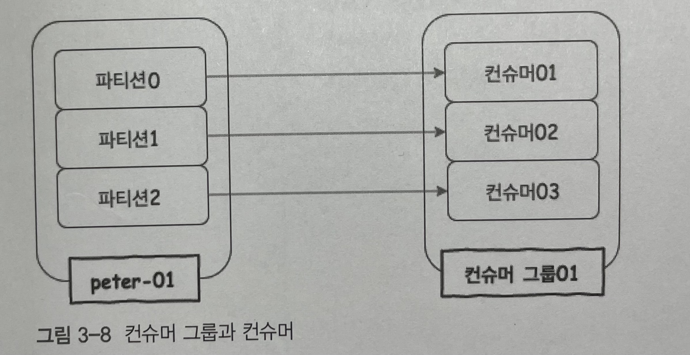

# [chap 3] 카프카 기본 개념과 구조

# Kafka란?

> **비동기 방식의 대표 스트리밍 플랫폼**
> 

### What is event streaming?

이벤트 스트리밍은 DB, 센서, 클라우드 서비스 및 소프트웨어 애플리케이션과 같은 이벤트 소스에서 실시간으로 데이터를 캡처하는 방식이다.

# 구성요소

1. **Event**
    
    `Event`는 kafka에서 Producer와 Consumer가 데이터를 주고 받는 단위
    
2. **Producer**
    
    `Producer`는 kafka에 이벤트를 게시(post)하는 클라이언트 애플리케이션을 의미
    
3. **Consumer**
    
    `Consumer`는 Topic을 구독하고 이로부터 얻어낸 이벤트를 처리하는 클라이언트 애플리케이션을 의미
    
4. **Topic**
    
    `Topic`은 이벤트가 쓰이는 곳
    
    Producer는 Topic에 이벤트를 게시한다. 그리고 Consumer는 Topic으로 부터 이벤트를 가져와 처리
    
    Topic은 파일 시스템의 ‘폴더’와 비슷하며, 이벤트는 폴더 안의 ‘파일'과 유사하다.
    
    Topic에 저장된 이벤트는 필요한 만큼 다시 읽을 수 있다.
    
5. **Partition**
    
    Topic은 여러 Broker에 분산되어 저장되며, 이렇게 분산된 Topic을 `Partition`이라고 한다.
    
    어떤 이벤트가 Partition에 저장될지는 이벤트의 key에 의해 정해지며, 같은 키를 가진 이벤트는 항상 같은 Partition에 저장된다.
    
    Kafka는 Topic의 Partition에 지정된 `Consumer`가 항상 정확히 동일한 순서로 Partition의 이벤트를 읽을 것을 보장한다.
    

## 3.1. 카프카 기초 다지기

### 3.1.1 리플리케이션

카프카에서 `replication`이란 각 메세지들을 여러 개로 복제해서 카스카 클러스터 내 브로커들에 분산시키는 동작을 의미

이러한 리플리케이션 동작 덕분에 하나의 브로커가 종료되더라도 카프카는 안정성을 유지할 수 있다.

`replication-factor` 수가 커지면 안정성은 높아지지만 그만큼 브로커 리소스를 많이 사용하게 되므로 최대한 브로커를 효율적으로 사용해야 한다 (ex. 개발환경 - 1, 운영환경 (로그성 메세지로 약간의 유실 허용) - 2, 운영환경(유실 허용X) - 3)

### 3.1.2 파티션

하나의 토픽이 한 번에 처리할 수 있는 한계를 높이기 위해 토픽 하나를 여러 개로 나눠 병렬 처리가 가능하게 만든 것을 파티션이라고 한다. 하나의 토픽을 여러개로 나눈다면 분산처리도 가능하다. 나뉜 파티션 수 만큼 컨슈머를 연결할 수도 있다.

파티션의 수는 초기 생성 후 언제든지 늘릴 수 있지만, 반대로 한 번 늘린 파티션 수는 절대로 줄일 수 없다는 점을 명심해야한다.

### 3.1.3 세그먼트

프로듀서에 의해 브로커에 전송된 메세지는 토픽의 파티션에 저장되며, 각 메세지는 세그먼트라는 로그 파일의 형태로 브로커의 로컬 디스크에 저장된다.

**지금까지 카프카 요청 흐름 정리**

1. 프로듀서는 카프카의 토픽으로 메세지를 전송
2. 토픽은 프로듀서로부터 받은 메세지를 파티션의 세그먼트 로그 파일에 저장
3. 브로커의 세그먼트 로그 파일에 저장된 메세지를 컨슈머가 읽어갈 수 있음.

## 3.2 카프카의 핵심 개념

### 3.2.1 분산 시스템

카프카도 분산 시스템이므로 최초 구성한 클러스터의 리소스가 한계치에 도달해 더욱 높은 메세지 처리량이 필요한 경우, 브로커를 추가하는 방식으로 확장이 가능하다.

### 3.2.2 페이지 캐시

카프카는 높은 처리량을 얻기 위해 페이지 캐시를 사용합니다.

페이지 캐시는 직접 디스크에 읽고 쓰는 대신 물리 메모리 중 애플리케이션이 사용하지 않는 일부 잔여 메모리를 활용합니다. 이렇게 페이지 캐시를 이용하면 디스크 I/O에 대한 접근이 줄어드므로 성능을 높일 수 있습니다.

카프카가 OS의 페이지 캐시를 이용한다는 것은 카프카가 직접 디스크에서 읽고 쓰기를 하지 않고 페이지 캐시를 통해 읽고 쓰기를 한다는 의미이다.

### 3.2.3 배치 전송 처리

카프카는 프로듀서, 컨슈머 클라이언트들과 서로 통신하며, 이들 사이에서 수많은 메세지를 주고 받습니다. 이때 발생하는 수많은 통신을 묶어서 처리할 수 있다면, 단건으로 통신할 때에 비해 네트워크 오버헤드를 줄일 수 있을 뿐만 아니라 장기적으로는 더욱 빠르고 효육적으로 처리할 수 있습니다.

### 3.2.4 압축 전송

카프카는 메세지 전송 시 좀 더 성능이 높은 압축 전송을 사용하는 것을 권장합니다.

압축만으로도 네트워크 대역폭이나 회선 비용 등을 줄일 수 있는데, 배치 전송과 함께 사용한다면 더욱 높은 효과를 얻게 됩니다.

### 3.2.5 토픽, 파티션, 오프셋

카프카는 토픽이라는 곳에 데이터를 저장합니다.

토픽은 병렬 처리를 위해 여러 개의 파티션이라는 단위로 다시 나눕니다. 카프카에서는 이와 같은 파티셔닝을 통해 단 하나의 토픽이라도 높은 처리량을 수행할 수 있습니다. 이 파티션의 메세지가 저장되는 위치를 오프셋이라고 부르며, 오프셋은 순차적으로 증가하는 숫자로 되어있습니다. 

카프카에서는 이 오프셋을 통해 메세지의 순서를 보장하고 컨슈머에서는 마지막까지 읽은 위치를 알 수도 있습니다.

(그림 출처 - [https://medium.com/@umanking/카프카에-대해서-이야기-하기전에-먼저-data에-대해서-이야기해보자-d2e3ca2f3c2](https://medium.com/@umanking/%EC%B9%B4%ED%94%84%EC%B9%B4%EC%97%90-%EB%8C%80%ED%95%B4%EC%84%9C-%EC%9D%B4%EC%95%BC%EA%B8%B0-%ED%95%98%EA%B8%B0%EC%A0%84%EC%97%90-%EB%A8%BC%EC%A0%80-data%EC%97%90-%EB%8C%80%ED%95%B4%EC%84%9C-%EC%9D%B4%EC%95%BC%EA%B8%B0%ED%95%B4%EB%B3%B4%EC%9E%90-d2e3ca2f3c2))

### 3.2.6 고가용성 보장

카프카는 분산 시스템이기 때문에 하나의 서버나 노드가 다운되어도 다른 서버 또는 노드가 장애가 발생한 서버의 역할을 대신해 안정적인 서비스가 가능합니다.

이러한 고가용성을 보장하기 위해 카프카에서는 리플리케이션 기능을 제공합니다. 카프카에서 제공하는 리플리케이션 기능은 토픽 자체를 복제하는 것이 아니라 토픽의 파티션을 복제하는 것입니다. 

### 3.2.7 주키퍼의 의존성

주키퍼는 카프카의 중요한 메타데이터를 저장하고 각 브로커를 관리하는 중요한 역할을 하고 있습니다.

## 3.3 프로듀서의 기본 동작과 예제

### 3.3.1 프로듀서 디자인

`ProducerRecord`라고 표시된 부분은 카프카로 전송하기 위한 실제 데이터이며, 레코드는 토픽, 파티션, 키, 벨류로 구성됩니다. 프로듀서가 카프카로 레코드를 전송할 때, 카프카의 특정 토픽으로 메세지를 전송합니다. 따라서 레코드에서 토픽과 벨류(메세지)는 필수값이며, 특정 파티션을 지정하기 위한 레코드의 파티션과 특정 파티션에 레코드를 정렬하기 위한 레코드의 키는 필수값이 아닌 선택사항입니다.

다음으로 각 레코드들을 프로듀서의 `send()` 메소드를 통해 시리얼라이저, 파티셔너를 거치게 됩니다.

만약 파티션을 지정했다면 파티셔너는 아무 동작도 하지 않고 지정된 파티션으로 레코드를 전달하지만, 파티션을 지정하지 않은 경우에는 키를 가지고 파티션을 선택해 레코드를 전달하는데, 기본적으로는 라운드 로빈 방식으로 동작합니다.

이렇게 프로듀서 내부에서는 `send()` 메소드 동작 이후 레코드들을 파티션별로 배치 전송을 위해 잠시 모아두게 됩니다. 

### 3.3.3 프로듀서 예제

프로듀서의 전송 방법은 크게 세 가지 방식으로 나눌 수 있습니다.

1. 메세지를 보내고 확인하지 않기
    - 실제 운영환경에서 추천하진 않으나 카프카는 항상 살아 있고, 프로듀서 또란 자동으로 재시작하므로 대부분은 성공적으로 메세지를 전송함
2. 동기 전송
    - 메세지 전송 성공 여부를 파악할 수 있으므로 신뢰정있는 메세지 전송이 가능
    - 단, 동기 전송의 경우 프로듀서가 보낸 모든 메세지에 대해 응답을 기다려 많은 시간을 소비하게 되므로 빠른 전송을 할 수 없음
3. 비동기 전송
    - 비동기 방식으로 전송할 경우 빠른 전송이 가능하며, 메세지 전송이 실패한 경우라도 예외 처리를 할 수 있으므로 에러 로그 등에 기록할 수 있음

### 3.4 컨슈머의 기본동작과 예제

컨슈머는 메세지를 가져올 때, 내부적으로 컨슈머 그룹, 리밸런싱 등 여러 동작을 수행합니다.

프로듀서가 아무리 빠르게 카프카로 메세지를 전송하더라도 컨슈머가 카프카로부터 빠르게 메세지를 읽어오지 못한다면 결국 지연이 발생하므로 컨슈머의 역할은 매우 중요합니다.

### 3.4.1 컨슈머의 기본 동작

프로듀서가 카프카의 토픽으로 메세지를 전송하면 해당 메세지들은 브로커들의 로컬 디스크에 저장됩니다. 그리고 우리는 컨슈머를 이용해 토픽에 저장된 메세지를 가져올 수 있습니다.

컨슈머 그룹은 하나 이상의 컨슈머들이 모여 있는 그룹을 의미하고, 컨슈머는 반드시 컨슈머 그룹에 속하게 됩니다. 그리고 이 컨슈머 그룹은 각 파티션의 리더에게 카프카 토픽에 저장된 메세지를 가져오기 위한 요청을 보냅니다. 이때 파티션 수와 컨슈머 수는 일대일로 매핑되는 것이 이상적입니다.

컨슈머 그룹 내에서 리밸런싱 동작을 통해 장애가 발생한 컨슈머의 역할을 동일한 그룹에 있는 다른 컨슈머가 그 역할을 대신하므로 굳이 장애 대비를 위한 추가 컨슈머 리소스를 할당하지 않아도 됩니다.

### 3.4.3 컨슈머 예제

컨슈머에서 메세지를 가져오는 방법은 크게 세 가지 방식이 있습니다.

1. 오토 커밋
    - 오토 커밋은 오프셋을 주기적으로 커밋하므로 관리자가 오프셋을 따로 관리하지 않아도 되는 장점이 있는 반면, 컨슈머 종료 등이 빈번히 일어나면 일부 메세지를 가져오지 못하거나 중복으로 가져오는 경우가 있습니다. 하지만, 카프카가 굉장히 안정적으로 잘 동작하고, 컨슈머 역시 한번 구동하고 나면 자주 변경되거나 종료된느 현상이 없으므로 오토 커밋을 사용하는 경우가 많습니다.
2. 동기 가져오기
    - 동기 방식으로 가져오는 경우 속도는 느리지만, 메세지 손실은 거의 발생하지 않습니다. 하지만 이 방식도 중복 이슈는 피할 수 없습니다.
3. 비동기 가져오기
    - 비동기 방식은 동기 방식과 달리 오프셋 커밋을 실패한다고 하더라도 재시도를 하지 않습니다. 
    비동기 커밋 재시도로 인해 마지막 비동기 커밋을 이전 커밋으로 덮어씌운다면 큰 중복 메세지 이슈가 발생할 것입니다. 이르어한 이유로 비동기 방식에서는 커밋 재시도를 하지 않습니다.

### 3.4.4 컨슈머 그룹의 이해

컨슈머는 컨슈머 그룹 안에 속한 것이 일반적인 구조로, 하나의 컨슈머 그룹 안에 여러 개의 컨슈머가 구성될 수 있습니다. 그리고 컨슈머들은 토픽의 파티션과 일대일로 매핑되어 메세지를 가져오게 됩니다.

예를 들어 컨슈머01이 문제가 생겨 종료됐다면, 컨슈머02 또는 컨슈머03이 컨슈머01이 하던 일을 대신해 peter-01 토픽의 파티션0을 컨슘하기 시작합니다.

### 출처
실전 카프카 개발부터 운영까지 - 고승범 지음
