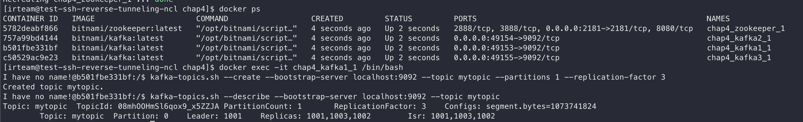
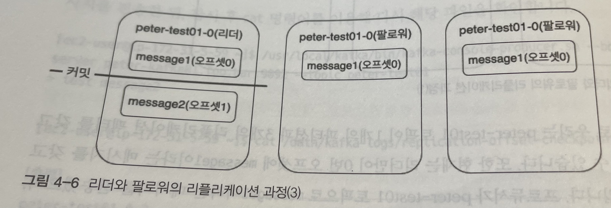

# [Chap 4] 카프카의 내부 동작 원리와 구현

# 4.1 카프카 리플리케이션

고가용성 분산 스트리밍 플랫폼인 카프카는 무수히 많은 데이터 파이프라인의 정중앙에 위치하는 메인 허브 역할을 합니다. 카프카는 중앙에서 메인 허브 역할을 하기 때문에 초기 설계 단계에서부터 브로커 한 두대에서 장애가 발생하더라도 안정적인 서비스가 운영될 수 있도록 구상됐습니다. 이때 안정성을 확보하기 위해 카프카 내부에서는 리플리케이션이라는 동작을 하게 됩니다.

### 4.1.1 리플리케이션 동작 개요

리플리케이션 설정을 하면 프로듀서가 보낸 메세지를 N대의 브로커들이 갖고 있을 수 있다.

이렇게 리플리케이션 팩터라는 옵션을 이용해 관리자가 지정한 수만큼의 리플리케이션을 가질 수 있기 때문에 N개의 리플리케이션이 있는 경우 N - 1까지의 브로커 장애가 발생해도 메세지 손실 없이 안정적으로 메세지를 주고 받을 수 있다.

**실습**

```yaml
version: '2'

services:
  zookeeper:
    image: 'bitnami/zookeeper:latest'
    ports:
     - '2181:2181'
    environment:
     - ALLOW_ANONYMOUS_LOGIN=yes
  kafka1:
    image: 'bitnami/kafka:latest'
    ports:
      - '9092'
    environment:
      - KAFKA_CFG_ZOOKEEPER_CONNECT=zookeeper:2181
      - ALLOW_PLAINTEXT_LISTENER=yes
  kafka2:
    image: 'bitnami/kafka:latest'
    ports:
      - '9092'
    environment:
      - KAFKA_CFG_ZOOKEEPER_CONNECT=zookeeper:2181
      - ALLOW_PLAINTEXT_LISTENER=yes
  kafka3:
    image: 'bitnami/kafka:latest'
    ports:
      - '9092'
    environment:
      - KAFKA_CFG_ZOOKEEPER_CONNECT=zookeeper:2181
      - ALLOW_PLAINTEXT_LISTENER=yes
```




Q. Replica 수는 무조건 Broker보다 작아야할까? 브로커보다 크다면?


Q. 책 예제는 Partition이 1임. 리플리케이션은 토픽이 아닌 파티션이 분산되는 것임. 그렇다면 Partition 설정을 2나 3으로 한다면 어떻게 될까? → 실습해보기

- topic이 replication되는게 아니라 partition이 replication 된다는게 이뜻이었나…


### 4.1.2 리더와 팔로워

모든 읽기와 쓰기 작업은 리더를 통해서만 가능합니다.

다시 말해, 프로듀서는 모든 리플리케이션에 메세지를 보내는 것이 아니라 리더에게만 메세지를 전송하고, 컨슈머도 오직 리더로부터 메세지를 가져옵니다.

팔로워들은 리더에 문제가 발생하거나 이슈가 있을 경우를 대비해 언제든지 새로운 리더가 될 준비를 해야합니다. 또한, 지속적으로 파티션의 리더가 새로운 메세지를 받았는지 확인하고, 새로운 메세지가 있다면 해당 메세지를 리더로부터 복제합니다.

### 4.1.3 복제 유지와 커밋

리더와 팔로워는 `ISR`이라는 논리 그룹으로 묶여있습니다. 이렇게 별도의 그룹으로 나누는 이유는 기본적으로 해당 그룹 안에 속한 팔로워들이 새로운 리더의 자격을 가질 수 있기 때문입니다. 다시 말해, ISR 그룹에 속하지 못한 팔로워는 리더가 될 자격이 없습니다.

팔로워에 어떠한 장애로 리더와의 데이터가 불일치한 상태에 놓여있다면, 해당 팔로워가 리더가 됐을 때 데이터 정합성 문제가 발생할 수 있으므로, 파티션의 리더는 팔로워들이 뒤쳐지지 않고 리플리케이션 동작을 잘 하고 있는지 감시합니다. 즉, 리더에 뒤처지지 않고 잘 따라잡고 있는 팔로워들만이 ISR 그룹에 속하게 되며, 리더에 장애가 발생할 경우 새로운 리더의 자격을 얻을 수 있습니다.

리더는 팔로워에 리플리케이션 동작에 문제가 발생했다고 판단하면 ISR 그룹에서 추방합니다. 즉, 토픽 상세보기를 통해 운영 환경에서 현재 토픽 상태가 양호한지 육안으로 확인해볼 수 있습니다.

ISR 내에서 모든 팔로워의 복제가 완료되면, 리더는 내부적으로 커밋되었다는 표시를 하게 됩니다. 마지막 커밋 오프셋 위치는 하이워터마크라고 부릅니다. 즉, 커밋되었다는 것은 리플리케이션 팩터 수의 모든 리플리케이션이 전부 메세지를 저장했음을 의미하고, 이렇게 커밋된 메세지만 컨슈머가 읽어갈 수 있습니다. 카프카에서 커밋되지 않은 메세지를 컨슈머가 읽을 수 없게 하는 이유는 바로 메세지의 일관성을 유지하기 위해서입니다.

### 4.1.4 리더와 팔로워의 단계별 리플리케이션 동작



리더는 1번 오프셋의 위치에 두 번째 새로운 메세지인 message2를 프로듀서로부터 받은 뒤 저장합니다. 0번 오프셋에 대한 리플리케이션 동작을 마친 팔로워들은 리더에게 1번 오프셋에 대한 리플리케이션을 요청합니다. 팔로워들로부터 1번 오프셋에 대한 리플리케이션 요청을 받은 리더는 팔로워들의 0번 오프셋에 대한 리플리케이션 동작이 성공했음을 이니하고, 오프셋 0에 대해 커밋 표시를 한 후 하이워터마크를 증가시킵니다.

팔로워가 0번 오프셋에 대한 리플리케이션을 성공하지 못했다면, 팔로워는 1번 오프셋에 대한 리플리케이션 요청이 아닌 0번 오프셋에 대한 리플리케이션 요청을 보내게 됩니다. 따라서 리더는 팔로워들이 보내는 리플리케이션 요청의 오프셋을 보고, 팔로워들이 어느 위치의 오프셋까지 리플리케이션을 성공했는지 인지할 수 있습니다.

또한, 이러한 리플리케이션 동작에서 ACK 통신을 제외했음에도 불구하고 팔로워와 리더 간의 리플리케이션 동작이 매우 빠르게 신뢰할 수 있다는 것이 카프카의 장점입니다.

카프카에서 리더와 팔로워들의 리플리케이션 동작 방식은 리더가 push하는 방식이 아닌 팔로워들이 pull 하는 방식으로 동작하는데, pull 방식을 채택한 이유도 리플리케이션 동작에서 리더의 부하를 줄여주기 위함입니다.

### 4.1.5 리더에포크와 복구

LeaderEpoch는 카프카의 파티션들이 복구 동작을 할 때 메세지의 일관성을 유지하기 위한 용도로 사용됩니다.

# 4.2 컨트롤러

카프카의 클러스터 중 하나의 브로커가 컨트롤러 역할을 하게 되며, 파티션 ISR 리스트 중에서 리더를 선출합니다. 리더를 선출하기 위한 ISR 리스트 정보는 안전한 저장소에 보관되어 있어야 하는데, 가용성 보장을 위해 주키퍼에 저장되어 있습니다. 컨트롤러는 브로커가 실패하는 것을 예의주시하고 있으며, 만약 브로커의 실패가 감지되면 즉시 ISR 리스트 중 하나를 새로운 파티션 리더로 산출합니다. 그리고 나서 새로운 리더 정보를 주키퍼에 기록하고, 변경된 정보를 모든 브로커에게 전달합니다.
