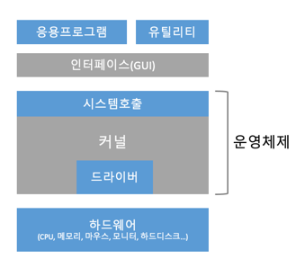
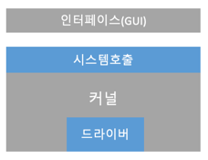

# 쉽게 배우는 운영체제
## Chap1. 운영체제의 개요
### 01. 운영체제 소개
 

#### 1. 운영체제
> 사용자에게 편리한 인터페이스 환경을 제공하고 컴퓨터 시스템의 자원을 효율적으로 관리하는 소프트웨어 

#### 2. 운영체제의 역할
- **자원관리**
  - 자원을 응용 프로그램에 나누어주어 사용자가 원활하게 작업할 수 있도록 돕는다.
  - 만약 자월을 요청한 프로그램이 여러 개라면 적당한 순서로 자원을 배부하고 적절한 시점에 자원을 회수하여 다른 응용 프로그램에 나누어준다.
- **자원 보호**
  - 운영체제는 사용자가 직접 자원에 접근하는 것을 막음으로써 컴퓨터 자원을 보호한다.
  - 비정상적인 작업으로부터 컴퓨터 자원을 지키는 것도 운영체제의 역할 중 하나이다.
- **하드웨어 인터페이스 제공**
  - 하드웨어 인터페이스 지원은 드라이버를 컴퓨터에 설치해야 가능하다.
  - 운영체제는 하드웨어 인터페이스가 자동으로 설치되게함으로써 하드웨어 종류에 상관없이 사용할 수 있게 해준다.
- **사용자 인터페이스 제공**
  - 하드웨어 인터페이스가 다양한 부품을 편리하게 사용하기 위한 것이라면, 사용자 인터페이스는 사용자가 운영체제를 편리하게 사용하도록 지원하기 위한 것이다.

#### 3. 운영체제의 목표

|운영체제의 역할|운영체제의 목표|
|---|---|
|자원관리|효율성|
|자원보호|안정성|
|하드웨어 인터페이스 제공|확장성|
|사용자 인터페이스 제공|편리성|

- **효율성**
  - 운영체제의 목표는 자원을 효율적으로 관리하는 것이다.
  - 적은 자원을 사용하여 결과를 빨리 보여주는 것이 효율적인 운영체제이다.
- **안정성**
  - 운영체제는 하드웨어 전체를 관리하는 소프트웨어로, 사용자와 응용 프로그램은 운영체제위에서 작업한다고 볼 수 있다.
  - 운영체제가 안정적이려면 사용자와 응용 프로그램의 안전 문제와 하드웨어적인 보안 문제를 처리할 수 있어야 하며, 시스템에 문제가 발생했을 때 이전으로 복구하는 결과 포용 기능을 수행해야 한다.
- **확장성**
  - 운영체제는 다양한 시스템 자원을 추가하거나 제거하기가 편리해야 한다.
- **편리성**
  - 사용자가 편리하게 작업할 수 있는 환경을 제공하는 것 또한 운영체제의 목표이다.

### 03. 운영체제의 구조
 

#### 1. 커널과 인터페이스
커널(kernel)은 프로세스 관리, 메모리 관리, 저장장치 관리와 같은 운영체제의 핵심적인 기능을 모아놓은 것이다.

[그림 1-20] 컴퓨터 시스템의 구조

위 그림을 보면 운영체제는 크게 두 부분으로 나뉜다. 사용자와 응용프로그램에 인접하여 커널에 명령을 전달하고 실행 결과를 사용자와 응용 프로그램에 돌려주는 인터페이스와 운영체제의 핵심 기능을 모아놓은 커널이 그것이다.

#### 2. 시스템 호출과 디바이스 드라이버

1) 시스템 호출 
시스템 호출은 커널이 자신을 보호하기 위해 만든 인터페이스이다. 커널은 사용자와 응용 프로그램으로부터 컴퓨터 자원을 보호하기 위해 자원에 직접 접근하는 것을 차단한다. 
2) 드라이버 
응용 프로그램과 커널의 인터페이스가 시스템 호출이라면 커널과 하드웨어의 인터페이스는 드라이버가 담당한다. 커널은 입출력의 기본적인 부분만 제작하고, 하드웨어 특성을 반영한 소프트웨어를 하드웨어 제작자에게 받아 커널이 실행될 떄 함께 실행되도록 한다. 
 
[그림 1-23] 운영체제의 구조 
시스템 호출 부분은 커널 앞부분 전체를 감싸고 있는데, 이는 시스템 호출을 거치지 않고 커널에 진입할 수 없다는 의미이다. 
반면에 드라이버는 커널 전체를 감싸고 있지 않다. 이는 커널이 제공하는 드라이버도 있고(마우스, 키보드와 같은 복잡하지 않은 디바이스 드라이버) 하드웨어 제작자가 제공하는 드라이버도 있다는 뜻으로, 하드웨어는 커널과 직접 연결되기도 하고 하드웨어 제작자가 제공하는 드라이버를 통해 연결되기도 한다.

#### 3. 커널의 구성
커널이 주로 하는 일은 프로세스 관리, 메모리 관리, 파일 시스템 관리, 입출력 관리, 프로세스 간 통신 관리 등이다.

|핵심 기능|설명|
|---|---|
|프로세스 관리|프로레스에 CPU를 배분하고 작업에 필요한 제반 환경을 제공한다.|
|메모리 관리|프로세스에 작업 공간을 배치하고 실제 메모리보다 큰 가상공간을 제공한다.|
|파일 시스템 관리|데이터를 저장하고 접근할 수 있는 인터페이스를 제공한다.|
|입출력 관리|필요한 입력과 출력 서비스를 제공한다.|
|프로세스간 통신 관리|공동 작업을 위한 각 프로세스 간 통신 환경을 지원한다.|

1) 단일형 구조 커널
> 단일형 구조 커널은 초창기의 운영체제 구조로, 커널의 핵심 기능을 구현하는 모듈들이 구분 없이 하나로 구성되어 있음 
- 장점
  - 모듈이 거의 분리되지 않았기 때문에 모듈 간의 통신 비용이 줄어들어 효율적인 운영이 가능하다.
- 단점
  - 모든 모듈이 하나로 묶여 있기 때문에 버그나 오류를 처리하기가 어렵다.
  - 운영체제의 여러 기능이 서로 연결되어 있어 상호 의존성이 높기 떄문에 기능상의 작은 결함이 시스템 전체로 확산될 수 있다.
  - 다양한 환경의 시스템에 적용하기 어렵다. 여러 종류의 컴퓨터에 이식하려면 수정이 필요한데 단일형 구조에서는 수정이 어렵기 때문에 이식성이 낮다.
  - 현대의 운영체제는 매우 크고 복잡하기 때문에 완전 단일형 구조의 운영체제를 구현하기가 어렵다.

2) 계층형 구조 커널
> 계층형 구조 커널은 단일형 구조 커널이 발전된 형태로, 비슷한 기능을 가진 모듈을 묶어서 하나의 계층으로 만들고 계층 간의 통신을 통해 운영체제를 구현하는 방식

- 비슷한 기능을 모아 모듈화했기 때문에 단일형 구조보다 버그나 오류를 쉽게 처리할 수 있다. 
- 마이크로소프트의 윈도우를 비롯해 오늘날의 운영체제는 대부분 이 구조로 이루어짐

3) 마이크로 구조 커널
> 마이크로 구조 커널의 운영체제는 프로세스 관리, 메모리 관리, 프로세스 간 통신 관리 등 가장 기본적인 기능만 제공
- 커널의 구조를 살펴보면 다른 커널에 비해 운영체제의 많은 부분이 사용자 영역에 구현되어 있다.
- 커널은 메모리 관리와 프로세스 간의 동기화 서비스를 제공하며, 메모리 관리자와 동기화 모듈은 프로세스 간 통신 모듈로 연결되어 있다. 그러므로 각 모듈은 세분화되어 존재하고 모듈 간의 정보 교환은 프로세스 간 통신을 이용하여 이루어진다.

4) 가상머신
> 가상머신은 운영체제와 응용 프로그램 사이에서 작동하는 프로그램으로, 가상 머신을 설치하면 응용 프로그램이 모두 동일한 환경에서 작동하는 것처럼 보인다.
