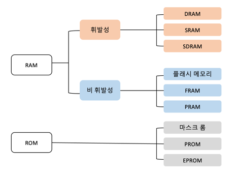
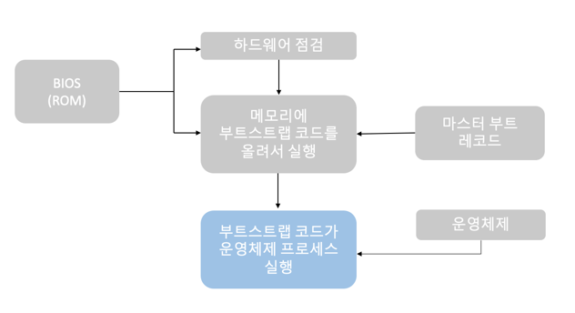

# 쉽게 배우는 운영체제
## Chap2. 컴퓨터의 구조와 성능 향상
### 01. 컴퓨터의 기본 구성
#### 1. 하드웨어의 구성
1) CPU와 메모리
- CPU : 명령어를 해석하여 실행하는 장치
- 메모리 : 작업에 필요한 프로그램과 데이터를 저장하는 장소
2) 입출력장치
- 입력장치 : 외부의 데이터를 컴퓨터에 입력하는 장치
- 출력장치 : 컴퓨터에서 처리한 결과를 사용자가 원하는 형태로 출력하는 장치
3) 저장장치
- 메모리는 전자의 이동으로 데이터를 처리하지만 하드디스크나 CD와 같은 저장장치는 구동장치가 있는 기계이므로 속도가 느리다. 이렇게 느린 저장장치를 사용하는 이유는 저장 용량에 비해 가격이 싸기 때문이다.
4) 메인보드
- 메인보드는 CPU와 메모리 등 다양한 부품을 연결하는 커다란 판이다.

#### 2. 폰노이만 구조
> 모든 프로그램은 메모리에 올라와야 실행할 수 있다.

### 02. CPU와 메모리
#### 1. CPU 구성과 동작
- 산술논리 연산장치 : CPU에서 데이터를 연산하는 장치
- 제어장치 : CPU에서 작업을 지시하는 부분
- 레지스터 : CPU 내에 데이터를 임시로 보관하는 곳

|레지스터|특징|
|---|---|
|[사용자 가시 레지스터] 데이터 레지스터(DR)|CPU가 명령어를 처리하는데 필요한 일반 데이터를 임시로 저장하는 범용 레지스터이다.|
|[사용자 가시 레지스터] 주소 레지스터(AR)|데이터 또는 명령어가 저장된 메모리의 주소를 저장한다.|
|[사용자 불가시 레지스터] 프로그램 카운터(PC)|다음에 실행할 명령어의 위치 정보를 저장한다.|
|[사용자 불가시 레지스터] 명령어 레지스터(IR)|현재 실행 중인 명령어를 저장한다.|
|[사용자 불가시 레지스터] 메모리 주소 레지스터(MAR)|메모리 관리자가 접근해야 할 메모리의 주소를 저장한다.|
|[사용자 불가시 레지스터] 메모리 버퍼 레지스터(MBR)|메모리 관리자가 메모리에서 가져온 데이터를 임시로 저장한다.|
|[사용자 불가시 레지스터] 프로그램 상태 레지스터(PSR)|연산 결과를 저장한다.|

#### 2. 메모리의 종류와 부팅
1) 메모리의 종류 
메모리는 크게 두 가지로 나눌 수 있다. 읽거나 쓸 수 있는 램(RAM)과 읽기만 가능한 롬(ROM)으로 구분된다. 
램은 전력이 끊기면 데이터가 사라지는 휘발성 메모리와 전력이 끊겨도 데이터를 보관할 수 있는 비휘발성 메모리로 나뉜다.

- 휘발성 메모리
  - DRAM(Dynamic RAM) : 데이터가 일정 시간이 지나면 사라지므로 다시 재생시켜야 함
  - SRAM(Static RAM) : 전력이 공급되는 동안에는 데이터를 재생할 필요 없음. 속도는 빠르지만 비쌈
  - SDRAM(Synchronous Dynamic RAM) : DRAM이 발전된 형태로 클록틱이 발생할때마다 데이터를 저장하는 동기 DRAM
- 비휘발성 메모리
  - 비휘발성 메모리는 전력이 끊겨도 데이터를 보관해야 하므로 메모리 내부가 복잡하고 속도가 느리며 가격이 비싸다.
- ROM
  - RAM과 달리 ROM은 전력이 끊겨도 데이터를 보관하는 것이 장점이지만 데이터를 한 번 저장하면 바꿀 수 없다.

2) 부팅
> 컴퓨터를 켰을 때 운영체제를 메모리에 올리는 과정을 부팅이라고 한다.

- 사용자가 컴퓨터 전원을 키면 ROM에 저장된 BIOS가 실행된다.
- BIOS는 CPU, 메모리, 하드디스크 등 주요 하드웨어 작동 확인을 한다.
- 이상이 없으면 하드디스크의 MRB(Master Boot Record)에 저장된 프로그램을 메모리에 가져와 실행한다.
- 마스터 부트 레코드에 있는 부트스트랩이 메모리에 올라오면 하드디스크에 저장된 운영체제를 메모리로 불러온다.
