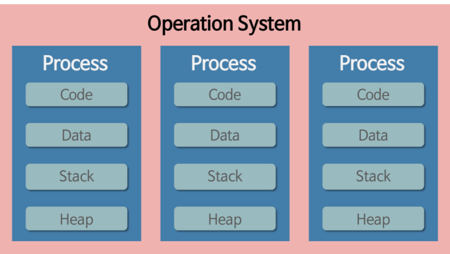
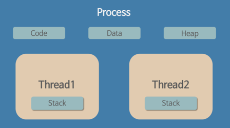

# 쉽게 배우는 운영체제
## Chap 03. 프로세스와 스레드
### 01. 프로세스의 개요
#### 1. 프로세스의 개념
- 프로그램 : 저장장치에 저장되어 있는 정적인 상태
- 프로세스 : 실행을 위해 메모리에 올라온 동적인 상태

#### 4. 프로세스의 상태
|상태|설명|작업|
|---|---|---|
|생성 상태|프로그램을 메모리에 가져와 실행 준비가 완료된 상태|메모리 할당, 프로세스 제어 블록 생성|
|준비 상태|실행을 기다리는 모든 프로세스가 자기 차례를 기다리는 상태  실행될 프로세스를 CPU 스케줄러가 선택| dispatch(PID): 준비 -> 실행|
|실행 상태|선택된 프로세스가 타임 슬라이스를 얻어 CPU를 사용하는 상태  프로세스 사이의 context switch가 발생|timeout(PID): 실행 -> 준비 exit(PID): 실행 -> 완료 block(PID) : 실행 -> 대기|
|대기 상태|실행 상태에 있는 프로세스가 입출력을 요청하면 입출력이 완료될떄까지 기다리는 상태 입출력이 완료되면 준비상태로 감|wakeup(PID): 대기 -> 준비|
|완료 상태|프로세스가 종료된 상태  사용하던 모든 데이터가 정리되며 정상종료인 exit과 비정상 종료인 abort를 포함|메모리 삭제, 프로세스 제어 블록 삭제|
- 휴식상태
  - 프로세스가 작업을 일시적으로 쉬고 있는 상태
  - 정지는 작업을 잠시 쉬고 있는 휴식 상태의 예로, 사용하던 데이터가 메모리에 그대로 있고 프로세스 제어 블록도 유지되므로 프로세스는 멈춘 지점에서부터 재시작할 수 있다.
- 보류 상태
  - 프로세스가 메모리에서 잠시 쫓겨난 상태로 휴식 상태와 차이가 있다.
  - 보류 상태로 들어간 프로세스는 메모리 밖으로 쫓겨나 swap area에 보관된다.

### 02. 프로세스 제어 블록과 문맥 교환
#### 1. 프로세스 제어 블록
> 프로세스를 실행하는 데 필요한 중요한 정보를 보관하는 자료 구조로 TCB(Task Control Block)라고도 함

#### 2. 문맥 교환(Context Switching)
> CPU를 차지하던 프로세스가 나가고 새로운 프로세스를 받아들이는 작업 
> 두 프로세스의 프로세스 제어 블록을 교환하는 작업

### 03. 프로세스의 연산
#### 1. 프로세스의 구조
|프로세스|설명|
|---|---|
|코드 영역|프로그램의 본문이 기술된 곳|
|데이터 영역|코드가 실행되면서 아용하는 변수나 파일 등의 각종 데이터를 모아놓은 곳|
|스택 영역|운영체제가 프로세스를 실행하기 위해 부수적으로 필요한 데이터를 모아놓은 곳|

#### 2. 프로세스의 생성과 복사
프로세스는 프로그램을 실행할 때 새로 생성된다. 사용자가 프로그램을 실행하면 운영체제는 프로그램을 메모리로 가져와 코드 영역에 넣고 프로세스 제어 블록을 생성한다. 그리고 메모리에 데이터 영역과 스택 영역을 확보한 후 프로세스를 실행한다.

1. fork()
> fork() 시스템 호출은 실행 중인 프로세스로부터 새로운 프로세스를 복사하는 함수이다. 이때 실행하던 프로세스는 부모 프로세스, 새로 생긴 프로세스는 자식 프로세스로서 부모-자식 관계가 된다.

프로세스를 새로 만들지 않고 fork() 시스템 호출로 프로세스를 복사하면 다음과 같은 장점이 있다.

- 장점
  - 프로세스의 생성 속도가 빠르다.
  - 추가 작업 없이 자원을 상속할 수 있다.
  - 시스템 관리를 효율적으로 할 수 있다.

#### 3. 프로세스의 전환
1. exec()
> exec() 시스템 호출은 기존의 프로세스를 새로운 프로세스로 전환하는 함수이다. exec() 시스템 호출을 사용하는 목적은 프로세스의 구조체를 재활용하기 위함이다.

### 04. 스레드
#### 1. 스레드의 개념
1. 스레드 정의
> 프로세스의 코드에 정의된 절차에 따라 CPU에 작업 요청을 하는 실행 단위이다.

2. 프로세스와 스레드의 차이
- 프로세스(Process)
  - “컴퓨터에서 연속적으로 실행되고 있는 컴퓨터 프로그램”
  - 메모리에 올라와 실행되고 있는 프로그램의 인스턴스(독립적인 개체)
  - 운영체제로부터 시스템 자원을 할당받는 작업의 단위
  - 즉, 동적인 개념으로는 실행된 프로그램을 의미한다.
  - 특징
    - 
    - 프로세스는 각각 독립된 메모리 영역(Code, Data, Stack, Heap의 구조)을 할당받는다.
    - 기본적으로 프로세스당 최소 1개의 스레드(메인 스레드)를 가지고 있다.
    - 각 프로세스는 별도의 주소 공간에서 실행되며, 한 프로세스는 다른 프로세스의 변수나 자료구조에 접근할 수 없다.
    - 한 프로세스가 다른 프로세스의 자원에 접근하려면 프로세스 간의 통신(IPC, inter-process communication)을 사용해야 한다.
      - Ex. 파이프, 파일, 소켓 등을 이용한 통신 방법 이용
- 스레드(Thread)
  - “프로세스 내에서 실행되는 여러 흐름의 단위”
  - 프로세스의 특정한 수행 경로
  - 프로세스가 할당받은 자원을 이용하는 실행의 단위
  - 특징
    - 
    - 스레드는 프로세스 내에서 각각 Stack만 따로 할당받고 Code, Data, Heap 영역은 공유한다.
    - 스레드는 한 프로세스 내에서 동작되는 여러 실행의 흐름으로, 프로세스 내의 주소 공간이나 자원들(힙 공간 등)을 같은 프로세스 내에 스레드끼리 공유하면서 실행된다.
    - 같은 프로세스 안에 있는 여러 스레드들은 같은 힙 공간을 공유한다. 반면에 프로세스는 다른 프로세스의 메모리에 직접 접근할 수 없다.
    - 각각의 스레드는 별도의 레지스터와 스택을 갖고 있지만, 힙 메모리는 서로 읽고 쓸 수 있다.
    - 한 스레드가 프로세스 자원을 변경하면, 다른 이웃 스레드(sibling thread)도 그 변경 결과를 즉시 볼 수 있다.

3. 스레드 관련 용어
- 멀티스레드
  - 프로세스 내 작업을 여러 개의 스레드로 분할함으로써 작업자의 부담을 줄이는 프로세스 운영 기법
- 멀티태스킹
  - 운영체제가 CPU에 작업을 줄 때 시간을 잘게 나누어 배분하는 기법
- 멀티프로세싱
  - CPU를 여러개 사용하여 여러 개의 스레드를 동시에 처리하는 작업 환경
- CPU 멀티스레드
  - 한 번에 하나씩 처리해야 하는 스레드를 파이프라인 기법을 이용하여 동시에 여러 스레드를 처리하도록 만든 병렬 처리 기법

### 2. 멀티스레드의 구조와 예
1. 멀티스레드 구조
fork()를 시스템 호출을 사용할 경우 코드, 프로세스 제어 블록, 공유 변수가 메모리의 여러 곳에 중복되어 메모리가 낭비된다. 
스레드는 이런 멀티태스킹의 낭비 요소를 제거하기 위해 사용한다. 비슷한 일을 하는 2개의 프로세스를 만드는 대신 코드, 데이터 등을 공유하면서 여러 개의 일을 하나의 프로세스 내에서 하는 것이다.

3. 멀티스레드의 장단점
- 장점
  - 응답성 향상: 한 스레드가 입출력에 인해 작업이 진행되지 않더라도 다른 스레드가 작업을 계속하여 사용자의 작업 요구에 빨리 응답 가능
  - 자원 공유: 한 프로세스 내에서 독립적인 스레드를 생성하면 프로세스가 가진 자원을 모든 스레드가 공유하게 되어 작업을 원활하게 진행 가능
  - 효율성 향상: 여러 개의 프로세스를 생성하는 것과 달리 멀티스레드는 불필요한 자원의 중복을 막음으로써 시스템의 효율이 향상됨
  - 다중 CPU 지원: 2개 이상의 CPU를 가진 컴퓨터에서 멀티스레드를 사용하면 다중 CPU가 멀티스레드를 동시에 처리하여 CPU 사용량이 증가하고 프로세스의 처리 시간이 단축된다.
- 단점
  - 멀티스레드의 사용으로 인해 다른 스레드에 영향이 갈 수 있다.

4. 멀티스레드 모델
- 커널 스레드: 커널이 직접 생성하고 관리하는 스레드
- 사용자 스레드: 라이브러리에 의해 구현된 일반적인 스레드

### 참고
- https://gmlwjd9405.github.io/2018/09/14/process-vs-thread.html
