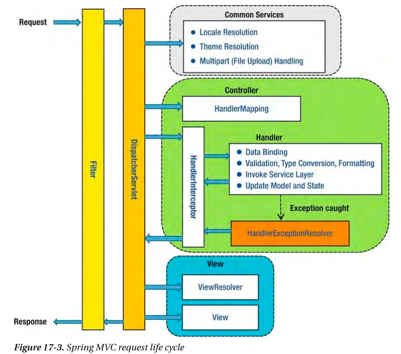

# Filter vs Interceptor
<br>
(그림 출처: https://justforchangesake.wordpress.com/2014/05/07/spring-mvc-request-life-cycle/)

## Filter
Filter는 Java Servlet에 정의된 개념<br>
Java Servlet의 스펙이므로 스프링 프레임워크 없이도 사용 가능하다.<br>
Spring MVC를 사용하는 경우 DispatcherServlet 전에 호출됨

## Interceptor
SpringFramework에서 자체적으로 제공하는 기능이다.<br>
DispatcherServlet에서 Handler(Controller)로 가기전에 처리한다.

### ModelAndView를 컨트롤 해야하는 경우
Filter는 DispatcherServlet의 전후의 요청을 처리할 수 있기 때문에 ModelAndView에 접근이 불가능하다.<br>
반면 Interceptor은 DispatcherServlet 사이클 안에서 사용되므로 ModelAndView에 접근이 가능하다.
```java
public interface HandlerInterceptor {
    boolean preHandle(HttpServletRequest request, HttpServletResponse response, Object handler);
    void postHandle(HttpServletRequest request, HttpServletResponse response, Object handler, ModelAndView mav);
    void afterCompletion(HttpServletRequest request, HttpServeletResponse response, Object handler, Exception ex);
}
```

### 참고
- https://cornswrold.tistory.com/56
- https://sowells.tistory.com/192
