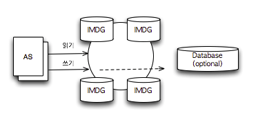
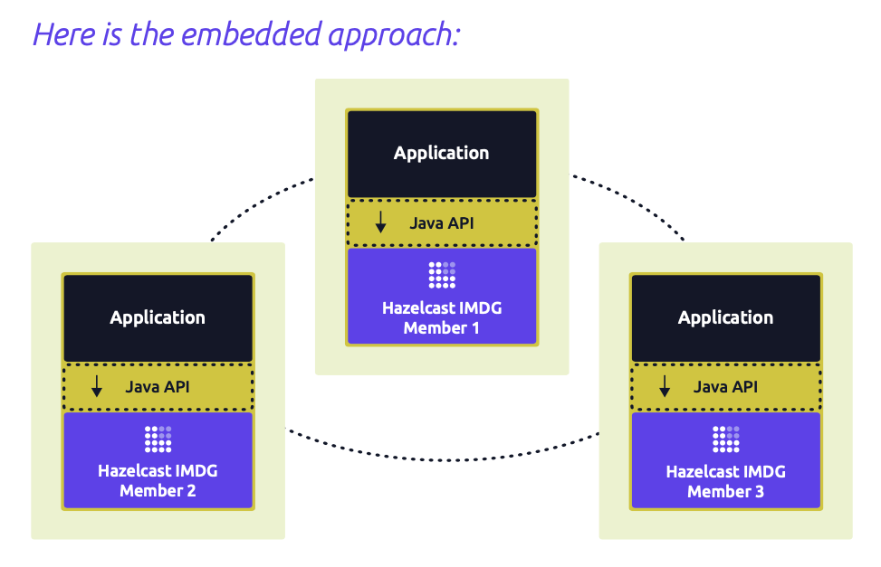
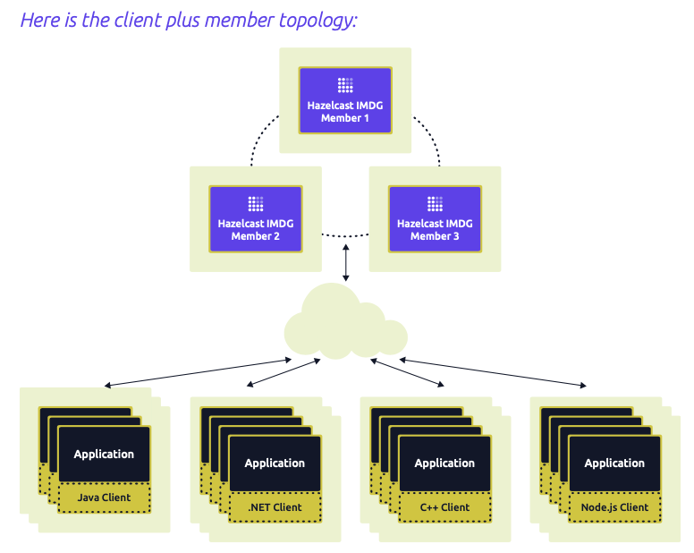
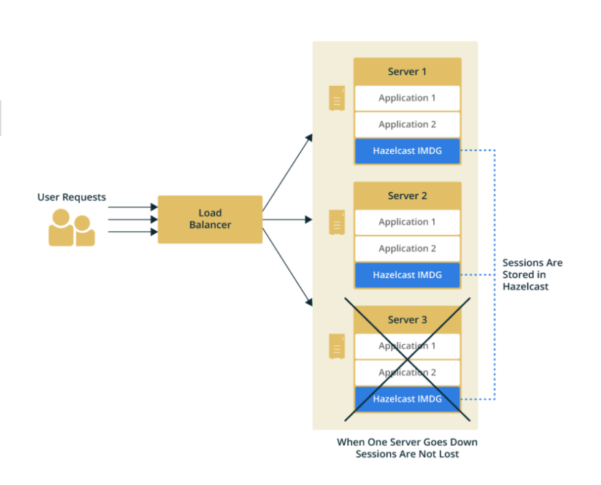

# Hazelcast

> **분산 환경에서 데이터 공유를 위한 ‘In Memory Data Grid’ 오픈 소스 솔루션**


### In Memory Data Grid (IMDG)

- 데이터가 여러 서버에 분산돼서 저장된다.
- 각 서버는 active 모드로 동작한다.
- 데이터 모델은 보통 객체 지향형(serialize)이고 non-relational이다.
- 필요에 따라 서버를 추가하거나 줄일 수 있는 경우가 많다.

→ 즉, IMDG는 데이터를 Main Memory에 저장하고 확장성(Scalability)을 보장하며, 객체 자체를 저장할 수 있도록 구현되었다.

### IMDG 아키텍처

여러 기기에 데이터를 나누어 저장하는 방식으로 전체 용량 증가를 꾀하는 Horizontal Scalability 방식을 사용한다.



### 캐시 시스템 vs IMDG

| | 캐시 시스템 | IMDG |
| --- | --- | --- |
| 읽기 | 캐시 안에 데이터가 있다면 DB에서 읽어오지 않는다.<br>캐시 안에 데이터가 없다면 DB에서 읽어온다. | 언제나 IMDG에서만 읽어온다. 항상 메인 메모리에서 읽어오기 때문에 빠르다. |
| 쓰기 | 영구 저장소에 쓰기 때문에 캐시 시스템 적용과 쓰기 성능 향상은 관계가 없다. | 영구 저장소에 데이터를 동기화하도록 구성하더라도, 비동기 쓰기 방식을 사용하며 유후 시간에 백업을 하기 때문에 Application 단에서는 쓰기 시간을 고려하지 않는다. |

## Hazelcast 소개

> **분산 환경에서 데이터 공유를 위한 In-Memory Data Grid 오픈소스 솔루션
자바 기반의 클러스터링과 확장성을 목표로 한 분산 플랫폼
물리적으로 떨어져 있는 여러 프로그램이 하나의 자료구조를 공유**
>

**Hazelcast is Simple**
- Hazelcast는 다른 종속성 없이 Java로 작성되었다.

**Hazelcast is Peer-to-Peer**
- master와 slave가 존재하지 않으며 모든 멤버가 동일한 양의 데이터를 저장하고 처리를 수행한다.

**Hazelcast is Scalable**
- Hazelcast는 확장에 용이하도록 설계되었다.

**Hazelcast is Fast**
- Hazelcast는 모든 것을 in-memory에 저장한다.

**Hazelcast is** **Redundant**
- Hazelcast는 각 데이터 항목의 백업을 여러 멤버에 유지한다.


### Deployment Topologies

1. **Embedded**
   
- 애플리케이션 코드가 포함된 JVM이 Hazelcast 클러스터에 직접 조인하는 방법
- 장점 : data 접근 지연 시간이 짧음

2. **Client/Server**

   
- 독립적인 Hazelcast 서버 인스턴스가 Hazelcast를 형성하는 방법
- 장점 : 안정적인 Hazelcast 성능, 내장형보다 더 나은 확장성을 가짐

### **Hazelcast for Web Session Clustering**

> **로드 밸런싱으로 묶인 WAS 그룹간의 세션 정보의 공유 목적으로 사용**

   

Hazelcast는 메모리의 클러스터에서 사용자 세션을 유지 관리하여 안정성을 위해 여러 복사본을 만든다.

모든 애플리케이션 서버는 모든 사용자 세션에 액세스할 수 있도록 Hazelcast에 액세스하도록 설정되고, 세션은 Hazelcast 클러스터 전체에 고르게 분산됩니다.

### Configuration

```java
@Bean
public HazelcastInstance hazelcastInstance() {
    Config hazelcastConfig = new Config();

    // Add this attribute to be able to query sessions by their PRINCIPAL_NAME_ATTRIBUTE's
    MapAttributeConfig attributeConfig = new MapAttributeConfig()
        .setName(PRINCIPAL_NAME_ATTRIBUTE)
        .setExtractor(PrincipalNameExtractor.class.getName());

    hazelcastConfig.getMapConfig(DEFAULT_SESSION_MAP_NAME)
        .addMapAttributeConfig(attributeConfig)
        .addMapIndexConfig(new MapIndexConfig(
            PRINCIPAL_NAME_ATTRIBUTE, false));
    
    return Hazelcast.newHazelcastInstance(hazelcastConfig);
}
```
