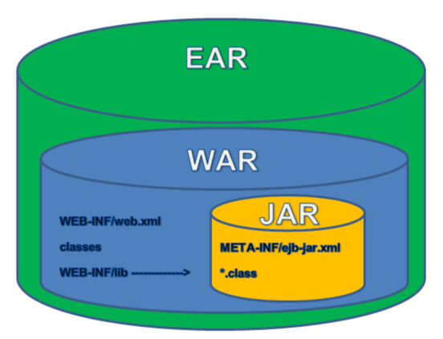

# JAR?WAR?

<br>
스프링 부트의 장점 중 하나는 실행가능한 JAR(Executable Jar)로 빌드해 프로젝트를 바로 실행시틸 수 있다는 점이다.<br>
기본적으로 JAR, WAR는 모두 Java의 jar(java -jar)을 이용해 생성된 압축(아카이브) 파일로, 애플리케이션을 쉽게 배포하고 동작시킬 수 있도록 관련 파일을 패키징한 것이다.

## JAR(Java Archive)
```java
META-INF/
    MANIFEST.MF
com/
    baeldung/
        MyApplication.class
```
- JAVA 애플리케이션이 동작할 수 있도록 자바 프로젝트를 압축한 파일
- Class(JAVA 리소스, 속성 파일), 라이브러리 파일을 포함함
- JRE(Java Runtime Envirionment)만 있어도 실행 가능함

## WAR(Web Application Archive)
```java
META-INF/
    MANIFEST.MF
WEB-INF/
    web.xml
    jsp/
        helloWorld.jsp
    classes/
        static/
        templates/
        application.properties
    lib/
        // *.jar files as libs
```
- Servlet/JSP 컨테이너에 배치할 수 있는 웹 애플리케이션 압축파일 포맷
- 웹 관련 자원을 포함(JSP, Sevlet, Class, XML, HTML, Javascript)
- 별도의 웹 서버(WEB) or 웹 컨테이너(WAS) 필요
- 즉, JAR 파일의 일종으로 웹 애플리테이션 전체를 패키징하기 위한 JAR 파일임


## 참고
https://www.baeldung.com/java-jar-war-packaging
https://hye0-log.tistory.com/27
