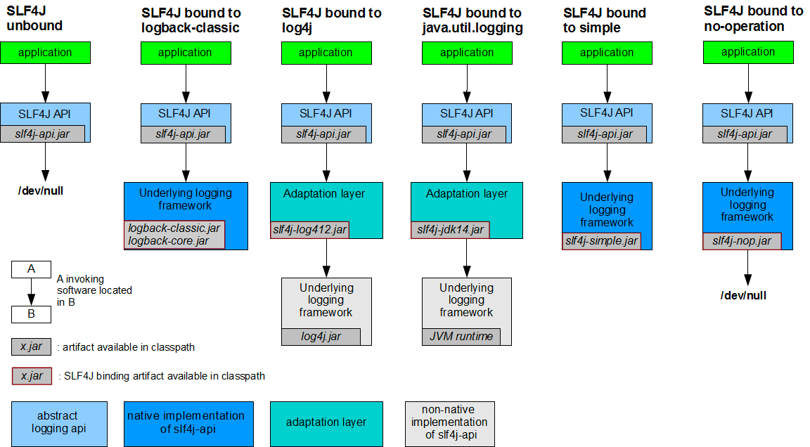
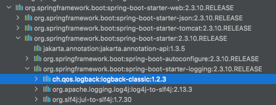

## Slf4j
Simple Logging Facade For Java의 약자로서 자체적인 로깅 프레임워크가 아닌 logger의 추상체로써 다른 로깅 프레임워크가 접근할 수 있도록 도와주는 추상화 계층이다.
즉, logback나 log4j2와 같은 로깅 프레임워트의 인터페이스의 역할을 해준다.



## Log4j
- 구성

|요소|설명|
|---|---|
|Logger|출력할 메세지를 Appender에게 전달|
|Appender|전달된 로그를 어디에 출력할 것인지 결정 (Console, File, JDBC)|
|Layout|로그를 어떤 형식으로 출력할 것인지 결정|

- 로그 레벨

|로그 레벨|설명|
|---|---|
|FATAL|아주 심각한 에러가 발생한 상태|
|ERROR|요청을 처리하는 중 문제가 발생한 상태|
|WARN|실행에는 문제가 없지만 향후 에러의 원인이 될 수 있는 경고성 메세지|
|INFO|상태변경과 같은 정보성 메세지|
|DEBUG|개발 시 디버그 용도로 사용하는 메세지|
|TRACE|디버그 레벨보다 상세한 이벤트를 나타내는 메세지|

## Logback
logback이란 log4j 이후에 출시된 Java 로깅 프레임워크 중 하나이다.
springboot를 사용할 경우 spring-boot-start-web 안에 logback Dependency가 포함되어있기 때문에 별도의 추가 없이 사용가능하다.



### Log4j vs Logback
- logback-classic은 slf4j를 구현한다.
- xml과 groovy 설정을 지원한다.
- 설정 변경시 자동 reload
  - 설정파일의 <configuration> 에서 scan속성을 true로 설정하게 되면 설정이 변경시 자동으로 변경된 설정을 다시 로드하게 됩니다.
    ```java
        <configuration scan="true">   ... </ configuration>
    ```
- 로그 I/O 오류 발생시 자동 복구
- 필요없는 로그 파일 자동 제거
  - TimeBasedRollingPolicy이나 SizeAndTimeBasedFNATP의 maxHistory 속성값을 설정하여 그동안 저장되어 쌓인 로그파일의 최대 수를 제어 할 수 있습니다.
- 보관 된 로그 파일의 자동 압축
- 설정파일에 조건문 사용
- 등등..

## Log4j2
가장 최신에 나온 로깅 프레임워트로 log4j의 다음 버전이다.

### Log4j vs Log4j2
- Automatic reloading of logging configurations
- Java8 람다 및 lazy evaluation 지원
- Multi Thread 환경에서 비동기 로거(Async Logger)의 경우 다른 로깅 프레임워크보다 처리량이 훨씬 많고, 대기 시간이 훨씬 짧다.


## 참고
- https://minkwon4.tistory.com/161
- https://dololak.tistory.com/632
- https://nikoskatsanos.com/blog/2016/08/log4j2-vs-log4j/
