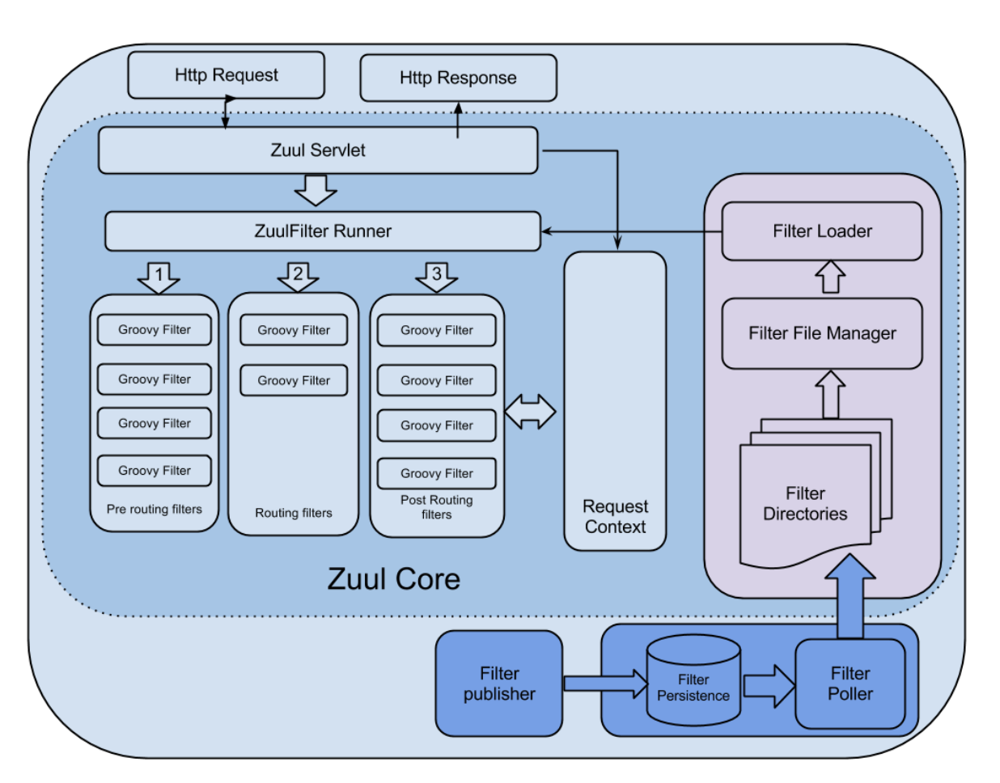
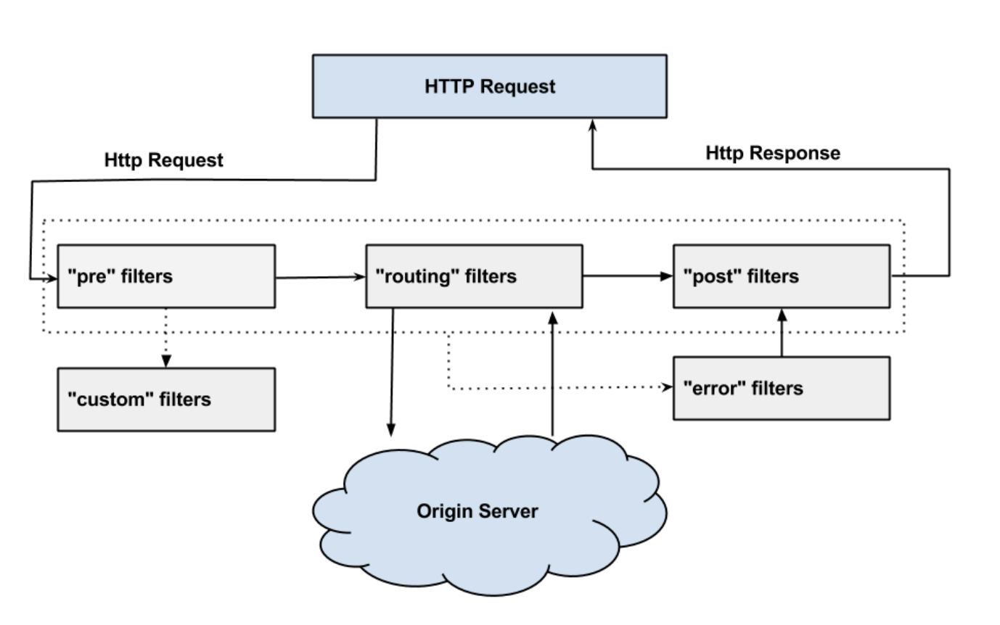

# Netflix Zuul

## Zuul core Architecture



([https://netflixtechblog.com/announcing-zuul-edge-service-in-the-cloud-ab3af5be08ee](https://netflixtechblog.com/announcing-zuul-edge-service-in-the-cloud-ab3af5be08ee))

Zuul Servlet을 통해 들어오는 요청을 Routing하는 구조

## Zuul Filter

> 요청이 들어오면 통과하게 되는 필터 타입
>



([https://netflixtechblog.com/announcing-zuul-edge-service-in-the-cloud-ab3af5be08ee](https://netflixtechblog.com/announcing-zuul-edge-service-in-the-cloud-ab3af5be08ee))

1. PRE
    - 라우팅되기 전에 실행
        - 요청에 대한 인증, origin(요청이 도달해야하는 서버) server 선택, 디버깅 정보를 로깅하는 등의 일을 함
2. ROUTING
    - origin으로의 요청 라우팅을 다룸.
    - origin에 대한 HTTP request가 생성되는 곳
3. POST
    - 요청이 origin에 도달한 이후 실행
    - 클라이언트에 보낼 응답에 HTTP header를 붙이거나, 통계나 지표 수집, origin에서 client로 응답을 스트리밍하는 등에 사용
4. ERROR
    - 다른단계에서 에러가 발생하면 실행

### Filter example
```java
public class CustomPreFilter extends ZuulFilter {

    @Override
    public String filterType() { // 필터 타입: pre, post, route, error
        return "pre"; 
    }

    @Override
    public int filterOrder() { // 필터 순서 숫자가 작을수록 우선
        return 0;
    }

    @Override
    public boolean shouldFilter() { // 필터 적용 여부 
        return true;
    }

    @Override
    public Object run() { 
        // 필터에서 사용할 로직
    }
}
```

### 참고
- https://netflixtechblog.com/announcing-zuul-edge-service-in-the-cloud-ab3af5be08ee
- https://techblog.woowahan.com/2523/
- https://jsonobject.tistory.com/464
