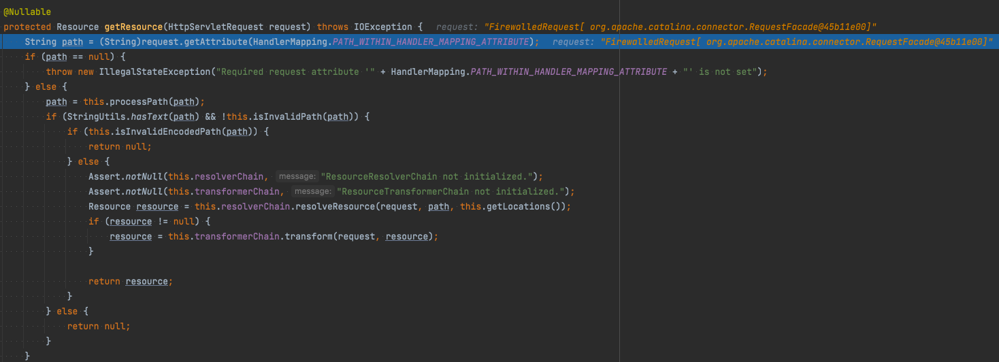

# ResourceHandlers에 등록한 pathPatterns가 사용되는 방식

```java
private WebProperties.Resources resources = new WebProperties().getResources();

@Override
public void addResourceHandlers(ResourceHandlerRegistry registry) {
    String staticPathPatterns[] = new String[]{
               "/**/*.js", "/**/*.png", "/**/*.jpg", "/**/*.css", "/**/*.html"};
    registry
        .addResourceHandler(staticPathPatterns)
        .addResourceLocations(this.resources.getStaticLocations());
}

// this.resources.getStaticLocations() = {"classpath:/META-INF/resources/", "classpath:/resources/", "classpath:/static/", "classpath:/public/"};
```

### 문제 개요

위 코드에서 `staticPathPatterns`를 `/js/*.js`와 같이 정확하게 경로를 지정하자 static resource를 요청했을 때 404가 발생했다.


빌드된 결과물 확인 시 static 폴더 밑에 js, css, img 폴더가 존재하므로 /js/*.js와 같이 경로를 지정했을때 classpath:/static/js/project.js로 찾아 갈 것을 기대했지만 실제로는 classpath:/static/project.js로 정적 파일을 찾아 404(NOT FOUND)가 난 것이다.

### PathResourceResolver


위 사진과 같이 이미 `PathResourceResolver`에 파라미터로 전달된 `requestPath`는 `project.js`로 넘어온 상태인데, 이 파라미터는 어디서 전달된걸까?

### 요청 흐름

`/js/project.js`로 정적 리소스를 요청했을 때  `dispatcherServlet.doDispatch()`를 호출한다.

위 코드를 참고하면 `doDispatch`에서는 request에 대해서 handler를 가져오는 `getHandler` 함수를 호출하고 있다.

이때, `AbstractUrlHandlerMapping.lookupHandler` 가 호출이 된다. 핵심은 이 메서드 내에서는 path를 가져오는 로직이 존재한다.
```java
// AbstractUrlHandlerMapping

@Nullable
protected Object lookupHandler(String lookupPath, HttpServletRequest request) throws Exception {
	... 
	this.validateHandler(handler, request);
	pathWithinMapping = this.getPathMatcher().extractPathWithinPattern(bestMatch, lookupPath);
	...
} 
```
여기서 this.getPathMatcher()=AntPathMatcher이었으며 이에 따라 당연하게 AntPathMatcher클래스의 extractPathWithinPattern이 호출된다.


위 코드에서 352번 라인을 보면 아스키코드 번호로 특정 문자를 포함하고 있는지 확인하는 로직이 있는데 42번은 `*`, 63번은 `?`를 의미한다. 즉, 분기처리에 따라 builder에  경로를 삽입하는 부분도  `*`나 `?`로 표시 되었던 부분만 삽입이 될 수 있기 때문에 `/js/*.js`라는 패턴을 사용했을 때 project.js로 path가 추출된 것이었다.


이렇게 추출된 경로는 이후 위와 같이 request에 PATH_WITHIN_HANDLER_MAPPING_ATTRIBUTE 라는 이름으로 attribute로 넣어주게 되고,  ResourceHttpRequestHandler에 의해 path를 가져올 때 사용이 된다.



이후 `this.resolverChain.resolveResource(request, path, this.getLocations())`를 호출하며 resource를 가져오게 되는데 이에 따라 가장 처음에 언급했던 `PathResourceResolver`가 사용된다.

### 결론
위와 같이 요청 흐름을 디버깅하면서 resourceHandler에 등록한 pathPattern이 어떤방식으로 파싱되는지 파악해보았다.
AntPathMatcher 클래스에서는 `*`, `?` 가 포함된 경로를 path로 추출하기 때문에 정확한 경로를 지정하고 싶다면 resourceLocations에 staticLocation을 등록할 때 상위 폴더까지 지정해줘야 할 것이다.
