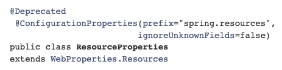

# 스프링부트 2.2.0 → 2.6.1 정리
Spring Boot 2.2.0에서 2.6.1으로 migrationg하며 겪은 이슈 정리

## [2.4.0 RELEASE NOTE](https://github.com/spring-projects/spring-boot/wiki/Spring-Boot-2.4-Release-Notes)

> 2.3.0 minimum requirements: Gradle 6.3+
>

### ****Versioning scheme change****

이전버전과 다르게 2.4.0 부터는 버전 이름 표기가 달라집니다.
ex) 2.3.5.RELEASE → 2.4.0

### ****JUnit 5’s Vintage Engine Removed from `spring-boot-starter-test`**

Spring Boot 2.4부터는 `spring-boot-starter-test`에서 JUnit vintage engine이 제거되어 JUnit class에서 `org.junit.Test`와 같은 컴파일 오류가 발생할 수 있습니다.

vintage engine을 사용하면 JUnit4로 작성된 테스트를 JUnit5에서 실행할 수 있습니다. 테스트를 JUnit 5로 마이그레이션하지 않고 JUnit4를 계속 사용하려면 아래와 같이 vintage engine dependency 추가가 필요합니다.

- maven

```xml
<dependency>
    <groupId>org.junit.vintage</groupId>
    <artifactId>junit-vintage-engine</artifactId>
    <scope>test</scope>
    <exclusions>
        <exclusion>
            <groupId>org.hamcrest</groupId>
            <artifactId>hamcrest-core</artifactId>
        </exclusion>
    </exclusions>
</dependency>
```

- gradle

```groovy
testImplementation("org.junit.vintage:junit-vintage-engine") {
    exclude group: "org.hamcrest", module: "hamcrest-core"
}
```

### ****Config File Processing (application properties and YAML files)****

- error log

```java
org.springframework.boot.context.config.InvalidConfigDataPropertyException: Property 'spring.profiles.active' imported from location 'class path resource [application-test.yml]' is invalid in a profile specific resource [origin: class path resource [application-test.yml] - 3:13]
```

- ****[Config file processing in Spring Boot 2.4](https://spring.io/blog/2020/08/14/config-file-processing-in-spring-boot-2-4)****

So in Spring Boot 2.4 we’re planning to make two significant changes to the way the properties and YAML files are loaded:

1. Documents will be loaded in the order that they’re defined.
2. Profiles can no longer be activated from profile specific documents.

- 해결방법
    - application-env.yml에서 env 설정 제거

```yaml
// application-test.yml profile 명시한 부분 제거
spring:
  profiles:
    active: test
...

```

### Deprecated

- **Class ResourceProperties**

> **Deprecated.** since 2.4.0 for removal in 2.6.0 in favor of WebProperties.Resources
>



ResourceProperties 이 2.4.0에서 Deprecated 되었고, 2.6.0에서 제거될 예정으로 ResourceProperties → WebProperties.Resources로 변경

**AS-IS**

```java
private ResourceProperties resourceProperties = new ResourceProperties();
```

**TO-BE**

```java
private WebProperties.Resources resourceProperties = new WebProperties().getResources();
```

## [Spring Boot 2.6 RELEASE NOTE](https://github.com/spring-projects/spring-boot/wiki/Spring-Boot-2.6-Release-Notes)

### PathPattern

기존에는 `AntPathMatcher`와 유사하게 경로 중간에도 `/**/a/**`와 같이 사용이 가능했지만, 더 이상 `**`

를 경로 중간에 사용할 수 없으며 마지막 경로에만 사용 가능합니다.

- error log


```groovy
***************************
APPLICATION FAILED TO START
***************************

Description:

Invalid mapping pattern detected: /**/fonts/**
^
No more pattern data allowed after {*...} or ** pattern element

Action:

Fix this pattern in your application or switch to the legacy parser implementation with 'spring.mvc.pathmatch.matching-strategy=ant_path_matcher'.
```

- [java docs - PathPattern](https://docs.spring.io/spring-framework/docs/current/javadoc-api/org/springframework/web/util/pattern/PathPattern.html)

  •  `*` matches zero or more characters within a path segment

  • `**` matches zero or more *path segments* until the end of the path

**해결방법**

1. application.yml에 spring.mvc.pathmatch.matching-strategy=ant_path_matcher 추가
2. 패턴 고치기
